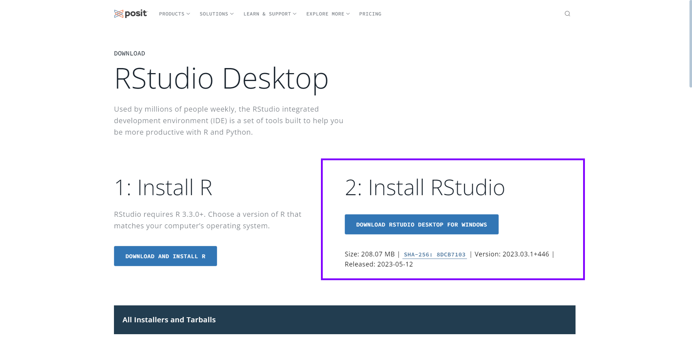
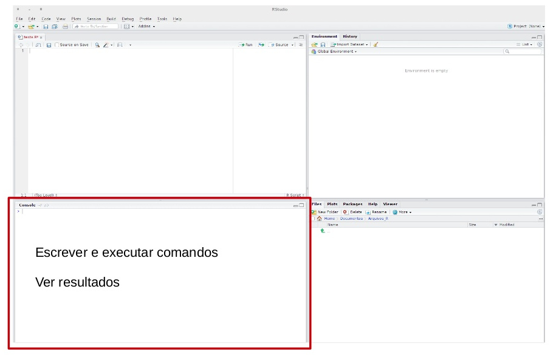
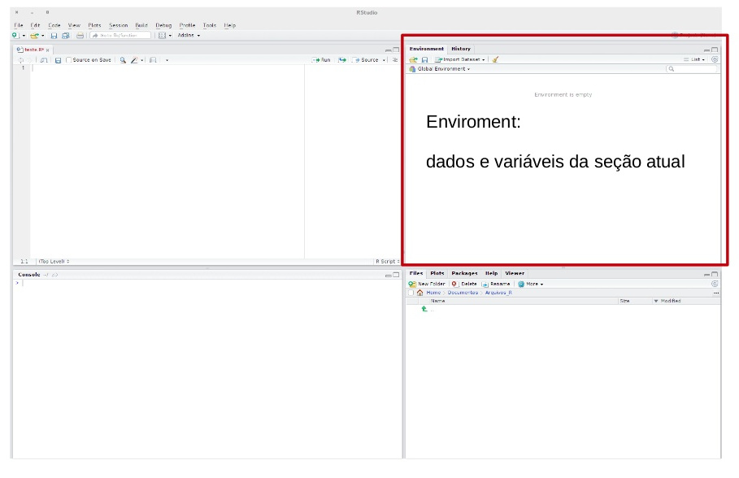
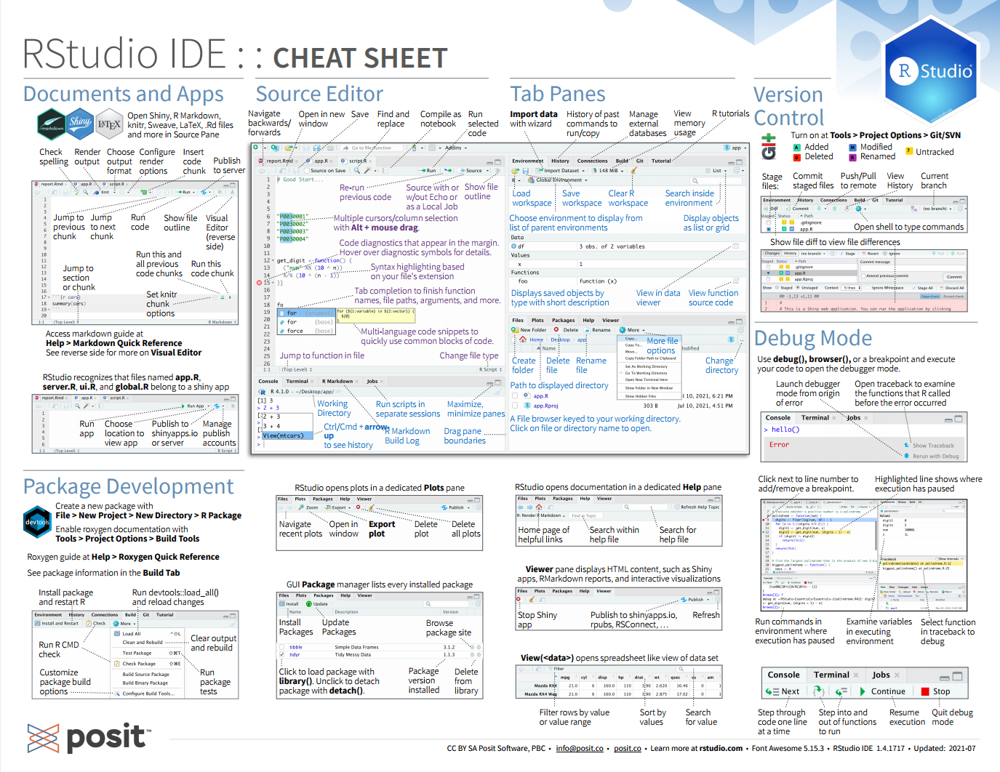

```{r setup, include=FALSE}
options(htmltools.dir.version = FALSE)
knitr::opts_chunk$set(
  fig.width=9, fig.height=3.5, fig.retina=3,
  out.width = "100%",
  cache = FALSE,
  echo = TRUE,
  message = FALSE, 
  warning = FALSE,
  hiline = TRUE
)
```

```{r xaringan-themer, include=FALSE, warning=FALSE}
xaringanthemer::style_duo_accent(
  primary_color = "#005c8b",
  secondary_color = "#0073ae",
  inverse_header_color = "#FFFFFF"
)
```

```{r xaringanExtra, echo=FALSE}
#devtools::install_github("gadenbuie/xaringanExtra")
# xaringanExtra::use_xaringan_extra(c("tile_view", "animate_css", "tachyons"))

xaringanExtra::use_clipboard()

xaringanExtra::use_fit_screen()

xaringanExtra::use_extra_styles(
  hover_code_line = TRUE,         #<<
  mute_unhighlighted_code = TRUE  #<<
)


```

```{r xaringanExtra-share-again, echo=FALSE}
xaringanExtra::use_share_again()
```

<!-- inicio font awesome -->
<script src="https://kit.fontawesome.com/1f72d6921a.js" crossorigin="anonymous"></script>
<!-- final font awesome -->

<!-- inicio github buttons  -->
<script async defer src="https://buttons.github.io/buttons.js"></script>
<!-- final github buttons  -->


.pull-left[
<br>
<br>
<br>
<br>
<br>
## Análises Econométricas

### Introdução a&nbsp;&nbsp;&nbsp; Linguagem R

**[Luísa Gisele Böck](https://luisa.rbind.io/)**&nbsp;&nbsp;    <a href='mailto:luisa.bock@acad.ufsm.br'><i class="far fa-envelope"></i></a>    <a href='https://twitter.com/lgiselebock'><i class="fab fa-twitter"></i>   <a href='https://github.com/lgiselebock'><i class="fab fa-github"></i></a>

__.can-edit[Junho de 2023]__

]

.pull-right[
<br>
<br>
<br>
```{r echo=FALSE, out.width="400px"}
knitr::include_graphics("img/slides/00-intro-allison-horst.png")
```

.center[Ilustração por [Allison Horst](https://allisonhorst.com/)]
]

---

class: inverse center middle

# R e RStudio

---

## Instalação do R

.pull-left[
<br>
<br>
<br>
<br>
<br>
- [Download](https://cran.r-project.org/)
- Use a versão mais recente `r emo::ji("wink")` 
]
.pull-right[
<br>
<br>
<br>
```{r, fig.align='center', out.width="70%", echo=FALSE}
knitr::include_graphics("img/slides/13-r-logo.svg")
```
]

---

## Instalação do R

```{r, fig.align='center', out.width="100%", echo=FALSE}
knitr::include_graphics("img/slides/14-r-install.png")
```

---

## Instalação do RStudio

.pull-left[
<br>
<br>
<br>
<br>
<br>
- [Download](https://posit.co/download/rstudio-desktop/)
- Use a versão mais recente `r emo::ji("wink")` 
]
.pull-right[
<br>
<br>
<br>
<br>
<br>
```{r, fig.align='center', out.width="70%", echo=FALSE}
knitr::include_graphics("img/slides/15-rstudio.png")
```
]

---

## Instalação do R

```{r, fig.align='center', out.width="100%", echo=FALSE}

```

---

### O que é o R?

> "R é um ambiente de software livre para computação estatística e gráficos". (https://www.r-project.org/)


  - **Por que usar o R?**

    - É uma linguagem de programação que possui muitas ferramentas para a análise de dados;

    - É em código aberto (*open source*);
  
    - Possui uma comunidade ativa de pessoas desenvolvedoras;
  
    - É flexível, permite desenvolver funções e pacotes para facilitar o trabalho;
  
    - Está disponível, gratuitamente, em diferentes plataformas: Windows, Linux e Mac;
  
    - Mantido pela [R Development Core Team](https://cran.r-project.org/).


<div class="my-header">Fonte: <a href="https://beatrizmilz.github.io/slidesR/introR/#1">Beatriz Milz</a></div>

---

### RStudio 

**RStudio** é uma IDE (*Integrated Development Environment*) da Linguagem R, isto é, um ambiente de desenvolvimento que utilizamos para editar e executar os códigos em R. Ela é mantida pela [Posit](https://posit.co/).

```{r, fig.align='center', echo=FALSE, out.width="700px"}
knitr::include_graphics("img/slides/01-rstudio.png")
```

<div class="my-header">Fonte: <a href="https://beatrizmilz.github.io/slidesR/introR/#1">Beatriz Milz</a></div>

---

### RStudio

**Editor/Scripts:** onde os códigos são escritos. O `RStudio` destaca algumas palavras e símbolos para facilitar a leitura do código.

```{r, fig.align='center', echo=FALSE, out.width="600px"}
knitr::include_graphics("img/slides/02-rstudio-haydee.jpg")
```

<div class="my-header">Fonte: <a href="https://curso-r.github.io/main-r4ds-1/slides/02-introducao-ao-r.html">Curso-R</a> e <a href="https://www.slideshare.net/haydeesvab/anlise-crtica-de-dados-primeiros-passos-com-r">Haydee Svab</a></div>

---

### RStudio

**Console**: é onde rodamos o código e recebemos as saídas. **O R vive aqui!**

```{r, fig.align='center', echo=FALSE, out.width="650px"}

```

<div class="my-header">Fonte: <a href="https://curso-r.github.io/main-r4ds-1/slides/02-introducao-ao-r.html">Curso-R</a> e <a href="https://www.slideshare.net/haydeesvab/anlise-crtica-de-dados-primeiros-passos-com-r">Haydee Svab</a></div>

---

### RStudio

**Environment:** painel com todos os objetos criados na sessão.

```{r, fig.align='center', echo=FALSE, out.width="650px"}

```

<div class="my-header">Fonte: <a href="https://curso-r.github.io/main-r4ds-1/slides/02-introducao-ao-r.html">Curso-R</a> e <a href="https://www.slideshare.net/haydeesvab/anlise-crtica-de-dados-primeiros-passos-com-r">Haydee Svab</a></div>

---

### RStudio

**History**: painel com um histórico dos comandos rodados.

```{r, fig.align='center', echo=FALSE, out.width="650px"}
knitr::include_graphics("img/slides/05-rstudio-haydee.jpg")
```

<div class="my-header">Fonte: <a href="https://curso-r.github.io/main-r4ds-1/slides/02-introducao-ao-r.html">Curso-R</a> e <a href="https://www.slideshare.net/haydeesvab/anlise-crtica-de-dados-primeiros-passos-com-r">Haydee Svab</a></div>

---

### RStudio

**Files**: mostra os arquivos no diretório de trabalho. É possível navegar entre diretórios.

```{r, fig.align='center', echo=FALSE, out.width="600px"}
knitr::include_graphics("img/slides/06-rstudio-haydee.jpg")
```

<div class="my-header">Fonte: <a href="https://curso-r.github.io/main-r4ds-1/slides/02-introducao-ao-r.html">Curso-R</a> e <a href="https://www.slideshare.net/haydeesvab/anlise-crtica-de-dados-primeiros-passos-com-r">Haydee Svab</a></div>

---

### RStudio

**Plots**: painel onde os gráficos serão apresentados.

```{r, fig.align='center', echo=FALSE, out.width="650px"}
knitr::include_graphics("img/slides/07-rstudio-haydee.jpg")
```

<div class="my-header">Fonte: <a href="https://curso-r.github.io/main-r4ds-1/slides/02-introducao-ao-r.html">Curso-R</a> e <a href="https://www.slideshare.net/haydeesvab/anlise-crtica-de-dados-primeiros-passos-com-r">Haydee Svab</a></div>

---

### RStudio

**Packages**: apresenta todos os pacotes instalados e carregados.

```{r, fig.align='center', echo=FALSE, out.width="650px"}
knitr::include_graphics("img/slides/08-rstudio-haydee.jpg")
```

<div class="my-header">Fonte: <a href="https://curso-r.github.io/main-r4ds-1/slides/02-introducao-ao-r.html">Curso-R</a> e <a href="https://www.slideshare.net/haydeesvab/anlise-crtica-de-dados-primeiros-passos-com-r">Haydee Svab</a></div>

---

### RStudio

**Help**: janela onde a documentação das funções serão apresentadas.

```{r, fig.align='center', echo=FALSE, out.width="650px"}
knitr::include_graphics("img/slides/09-rstudio-haydee.jpg")
```

<div class="my-header">Fonte: <a href="https://curso-r.github.io/main-r4ds-1/slides/02-introducao-ao-r.html">Curso-R</a> e <a href="https://www.slideshare.net/haydeesvab/anlise-crtica-de-dados-primeiros-passos-com-r">Haydee Svab</a></div>

---

### Atalhos

Conhecer os atalhos do teclado ajuda bastante durante a programação no `RStudio`

- **CTRL + ENTER:** avalia/roda a linha selecionada no script;

- **ALT + -:** cria no script um sinal de atribuição (`<-`);

- **CTRL + SHIFT + M:** adiciona o operador pipe (`%>%` ou `|>`);

- **CTRL + 1:** altera cursor para o script;

- **CTRL + 2:** altera cursor para o console.

- **ALT + SHIFT + K:** janela com todos os atalhos disponíveis.

<br> 

No MacOS, substitua `CTRL` por `Command` e `ALT` por `Option`.

<div class="my-header">Fonte: <a href="https://curso-r.github.io/main-r4ds-1/slides/02-introducao-ao-r.html">Curso-R</a></div>

---

### Help! 

Ficou com dúvida sobre determinado pacote ou função?

  - Peça ajuda: **help**(nome_da_funcao) ou **?**nome_da_funcao
  
  - Peça ajuda: **help**(nome_do_pacote) ou **?**nome_do_pacote

```{r, eval=FALSE}
help(sum)
?sum
```

  - Se a dúvida persistir, procure no Google ou no [Stack OverFlow](https://stackoverflow.com/)
  
  - E se ainda estiver com dúvidas, pergunte para a comunidade:
    
    - há diversos grupos no Telegram, no Twitter e em outras redes sociais.
   
<div class="my-header">Fonte: <a href="https://beatrizmilz.github.io/slidesR/introR/#1">Beatriz Milz</a></div>

---

### [Cheat Sheets](https://posit.co/resources/cheatsheets/) 

O **RStudio** disponibiliza algumas folhas de cola, as **Cheat Sheets**. Elas trazem um resumo de como utilizar diversos pacotes e até o próprio RStudio. Para acessá-la, basta clicar no menu `Help` e então em `Cheat Sheets`, ou através do site da [**Posit**](https://posit.co/resources/cheatsheets/) onde existem muitas opções de *Cheat Sheets*, incluindo algumas traduzidas para o Português.

[](https://posit.co/resources/cheatsheets/)

<div class="my-header">Fonte: <a href="https://livro.curso-r.com/2-5-cheatsheets.html#cheatsheets">Curso-R</a></div>
---

### O Ciclo da Ciência de Dados

```{r, fig.align='center', echo=FALSE, out.width="700px"}
knitr::include_graphics("img/slides/10-ciclo-ciencia-de-dados.png")
```

<div class="my-header">Fonte: <a href="https://beatrizmilz.github.io/cebrap-lab-intro-R-5-2022/slides/introducao-ao-curso.html#/">Beatriz Milz</a></div>

---

### O Ciclo da Ciência de Dados no R

```{r, fig.align='center', echo=FALSE, out.width="700px"}
knitr::include_graphics("img/slides/11-ciclo-ciencia-de-dados-no-r.png")
```

<div class="my-header">Fonte: <a href="https://beatrizmilz.github.io/cebrap-lab-intro-R-5-2022/slides/introducao-ao-curso.html#/">Beatriz Milz</a></div>

---

class: inverse center middle

# Introdução

.center[(Acompanhe no arquivo `01-introducao.R`)]

---

### R como calculadora

O **R** permite realizar muitas operações matemáticas!

```{r}
2 + 5 # adição

9 - 4 # subtração

5 * 2 # multiplicação

7/5 # divisão
```

- **`CTRL + ENTER`**: executa a linha selecionada no script

<div class="my-header">Fonte: <a href="https://beatrizmilz.github.io/slidesR/introR/#1">Beatriz Milz</a></div>

---

### R como calculadora

```{r}
9 %% 4 # resto da divisão de 9 por 4

7 %/% 4 # parte inteira da divisão de 7 por 4

8 ^ 2 # potenciação

sqrt(1024) # radiciação
```

A ordem matemática das operações também vale no R.

<div class="my-header">Fonte: <a href="https://beatrizmilz.github.io/slidesR/introR/#1">Beatriz Milz</a></div>

---

### Funções matemáticas

```{r}
sin(1) # funções trigonométricas

log(1) # logaritmo natural (base e)

log10(10) # logaritmo na base 10

exp(0.5) # exponencial e^(1/2)
```

<div class="my-header">Fonte: <a href="https://beatrizmilz.github.io/slidesR/introR/#1">Beatriz Milz</a></div>

---

### Objetos

O **R** te permite salvar valores dentro de um objeto. 

Um **objeto** é um nome que guarda um valor, uma função ou uma base de dados.

- Para atribuir um valor a um objeto no R, utilizamos o operador:
.center[**`<-`**]

.center[`nome_do_objeto <- valor`]

- Atalho: `ALT` + `-`: cria o `<-` sinal de atribuição.

<div class="my-header">Fonte: <a href="hhttps://beatrizmilz.github.io/slidesR/introR/#1">Beatriz Milz</a> e <a href="https://curso-r.github.io/main-r4ds-1/slides/02-introducao-ao-r.html">Curso-R</a></div>

---

#### Exemplo:

```{r}
nome <- "Camilo Sobreira de Santana"
nome

idade <- 54
idade

cargo_ou_funcao <- "Ministro da Educação"
cargo_ou_funcao

salario <- 39293.32
salario
```

<div class="my-header">Fonte: <a href="https://portaldatransparencia.gov.br/">Portal da Transparência</a> e <a href="https://pt.wikipedia.org/wiki/Camilo_Santana">Wikipedia</a></div>

---

### Nomes dos Objetos

Existem algumas regras para dar nomes aos objetos:

  - os nomes devem começar com uma letra. E podem conter letras, números, `_` e `.`. Não usar acentuações e espaços. O autor do livro [R for Data Science](https://r4ds.had.co.nz/) recomenda **usar_snake_case**, ou seja, palavras escritas em minúsculo separadas pelo underscore (`_`).
  
  - o `R` é `case sensitive`, isto é, faz a diferenciação entre as letras minúsculas e maiúsculas. Portanto, um objeto chamado `teste` é diferente de uma outro objeto chamado `Teste`.
  

```{r}
a <- 2
a

A <- 4
A
```

<div class="my-header">Fonte: <a href="hhttps://beatrizmilz.github.io/slidesR/introR/#1">Beatriz Milz</a> e <a href="https://curso-r.github.io/main-r4ds-1/slides/02-introducao-ao-r.html">Curso-R</a></div>

---

### Operadores Relacionais

- Igual a: **==**

- Diferente de: **!=**

- Maior que: **>**

- Maior ou igual a: **>=**

- Menor que: **<**

- Menor ou igual a: **<=**

<div class="my-header">Fonte: <a href="https://beatrizmilz.github.io/slidesR/introR/#1">Beatriz Milz</a></div>

---

### Operadores Relacionais

- Igual a: **==**

```{r}
TRUE == TRUE

TRUE == FALSE
```

- Diferente de: **!=**

```{r}
TRUE != TRUE

TRUE != FALSE
```

<div class="my-header">Fonte: <a href="https://beatrizmilz.github.io/slidesR/introR/#1">Beatriz Milz</a></div>

---

### Operadores Relacionais

- Maior que: **>**

```{r}
15 > 10

10 > 10
```

- Menor que: **<**

```{r}
3 < 5

10 < 5
```

<div class="my-header">Fonte: <a href="https://beatrizmilz.github.io/slidesR/introR/#1">Beatriz Milz</a></div>

---

### Operadores Relacionais

- Maior ou igual a: **>=**

```{r}
15 >= 10

15 >= 15
```

- Menor ou igual a: **<=**

```{r}
10 <= 10

10 <= 8
```

<div class="my-header">Fonte: <a href="https://beatrizmilz.github.io/slidesR/introR/#1">Beatriz Milz</a></div>

---

### Operadores Lógicos

- AND - E: **&**

Será verdadeiro (`TRUE`) se as duas condições forem verdadeiras

```{r}
x <- 15

  x >= 10 & x <= 20
  
y <- 7

  y >= 10 & y <= 15
```

<div class="my-header">Fonte: <a href="https://beatrizmilz.github.io/slidesR/introR/#1">Beatriz Milz</a></div>

---

### Operadores Lógicos

- OR - OU: **|**

Será verdadeiro (`TRUE`) se uma das duas condições for verdadeira

```{r}
x <- 5

  x >= 10 | x <= 15
  
y <- 2

  y >= 5 | y == 0
```

<div class="my-header">Fonte: <a href="https://beatrizmilz.github.io/slidesR/introR/#1">Beatriz Milz</a></div>

---

### Operadores Lógicos

- NOT - NEGAÇÃO: **!**

```{r}
!TRUE

!FALSE

x <- 8

  (!x < 5)
```

<div class="my-header">Fonte: <a href="https://beatrizmilz.github.io/slidesR/introR/#1">Beatriz Milz</a></div>

---

### Pertence

É possível verificar se um valor está inserido dentro de um conjunto de valores (vetor). 

É representado pelo símbolo `%in%`.

```{r}
3 %in% c(1, 2, 3)

"a" %in% c("b", "c")
```

<div class="my-header">Fonte: <a href="https://curso-r.github.io/main-r4ds-1/slides/02-introducao-ao-r.html">Curso-R</a></div>

---

### Tipos Básicos de dados

São os tipos de dados que podem ser representados na linguagem R. É neles que são guardadas as informações.

- **Integer**: números inteiros 

- **Double/Numeric**: números racionais 

- **Logical**: tipos lógicos, `TRUE` ou `FALSE` 

- **Character**: texto (sempre entre aspas)

- **Factor**: dados categóricos

<br>

A função `class()` retorna o tipo do dado.

<div class="my-header">Fonte: <a href="https://beatrizmilz.github.io/slidesR/introR/#1">Beatriz Milz</a></div>

---

### Números

Um número inteiro seguido de `L` será considera do tipo `integer`:

```{r}
class(5L)
```

Números racionais serão considerados como `double/numeric`:

```{r}
class(5)

class(5.1)
```

<div class="my-header">Fonte: <a href="https://beatrizmilz.github.io/slidesR/introR/#1">Beatriz Milz</a></div>

---

### Lógicos

Verdadeiro (`TRUE`) OU Falso (`FALSE`)

```{r}
class(TRUE)

class(FALSE)
```

O R entende o `TRUE` sendo igual a 1 (um), e o `FALSE` sendo igual a 0 (zero).

Isso significa que é possível realizar operações matemáticas com ele (por exemplo, somar):

```{r}
TRUE + FALSE + FALSE + TRUE + TRUE + TRUE + FALSE
```

<div class="my-header">Fonte: <a href="https://beatrizmilz.github.io/slidesR/introR/#1">Beatriz Milz</a></div>

---

### Textos

**Qualquer** código entre aspas será interpretado como texto (`character`):

```{r}
class("TEXTO")

escola <- c("Médio", "Superior", "Fundamental", "Fundamental", "Médio")
class(escola)

class("3")
```

<div class="my-header">Fonte: <a href="https://beatrizmilz.github.io/slidesR/introR/#1">Beatriz Milz</a></div>

---

### Fatores

Os fatores (ou `factors`) são usados para representar categorias. 

```{r}
# Criando um factor

escola_categorias <- factor(
  c("Médio", "Superior", "Fundamental", "Fundamental", "Médio")
)
escola_categorias

class(escola_categorias)
```

A função `as.factor()` cria um objeto do tipo `factor` ou converte um objeto já existente.

Na linha `levels` aparecem os rótulos do fator.

<div class="my-header">Fonte: <a href="https://beatrizmilz.github.io/slidesR/introR/#1">Beatriz Milz</a></div>

---

### NA

**NA** representa um valor desconhecido ou ausente. As operações envolvendo um valor desconhecido também resultarão em valores desconhecidos.

```{r}
NA > 10

NA + 10

NA / 5

10 == NA
```

<div class="my-header">Fonte: <a href="https://beatrizmilz.github.io/slidesR/introR/#1">Beatriz Milz</a></div>

---

### NA

```{r}
NA == NA
```

----

`is.na()` é a função que testa se um objeto é `NA`.

```{r}
vetor_numerico <- c(NA, 1, 2, 3, 4, 5, NA)

is.na(vetor_numerico)

!is.na(vetor_numerico)
```

<div class="my-header">Fonte: <a href="https://beatrizmilz.github.io/slidesR/introR/#1">Beatriz Milz</a></div>

---

### na.rm = TRUE

Quando a função não sabe o valor dos elementos que contém `NA`, ela não consegue realizar os cálculos e devolve `NA`. Na maioria dos casos, se quer saber o resultado de um cálculo de um vetor apesar dos `NAs`. Para isso, é utilizado o argumento `na.rm = TRUE`.

```{r}
sum(vetor_numerico)

sum(vetor_numerico, na.rm = TRUE)

mean(vetor_numerico)

mean(vetor_numerico, na.rm = TRUE)
```

<div class="my-header">Fonte: <a href="hhttps://beatrizmilz.github.io/slidesR/introR/#1">Beatriz Milz</a> e <a href="https://curso-r.github.io/main-r4ds-1/slides/02-introducao-ao-r.html">Curso-R</a></div>

---

### Conversão de classes

```{r}
vetor_logical <- c(TRUE, TRUE, FALSE, TRUE, FALSE)

as.integer(vetor_logical) # converte para um número inteiro

as.numeric(vetor_logical) # converte para um número

as.character(vetor_logical) # converte para um texto

as.factor(vetor_logical) # converte pra um fator
```

---

### Conversão de classes

```{r}
frutas <- c("amora", "banana", "melancia")

as.integer(frutas)

as.numeric(frutas)

as.character(frutas)

as.factor(frutas)
```


---

### Tipos de Objetos

No **R**, os quatro principais objetos são: 

  - Vetor;
  
  - Matriz;
  
  - Lista;
  
  - Data Frame

<div class="my-header">Fonte: <a href="https://beatrizmilz.github.io/slidesR/introR/#1">Beatriz Milz</a></div>

---

### Vetores

- Armazenam elementos de uma `mesma classe`, em apenas `uma dimensão`.

- Para criá-los, basta colocar os valores separados por vírgulas dentro da função `c()`.

```{r}
primeiro_semestre <- c(
  "Janeiro", "Fevereiro", "Março", "Abril", "Maio", "Junho"
)

primeiro_semestre

# retorna o comprimento do vetor - quantos elementos ele tem?
length(primeiro_semestre) 
```

<div class="my-header">Fonte: <a href="hhttps://beatrizmilz.github.io/slidesR/introR/#1">Beatriz Milz</a> e <a href="https://curso-r.github.io/main-r4ds-1/slides/02-introducao-ao-r.html">Curso-R</a></div>

---

### Vetores

Para criar um vetor com uma sequência de números, basta utilizar o operador **:**

```{r}
# Vetor de 1 a 10
1:10

# Vetor de 10 a 1
10:1

# Vetor de -5 a 5
-5:5
```

<div class="my-header">Fonte: <a href="https://curso-r.github.io/main-r4ds-1/slides/02-introducao-ao-r.html">Curso-R</a></div>

---

### Vetores

Por serem conjuntos indexados, cada valor dentro de um vetor tem uma posição. Essa posição é dada pela ordem em que os elementos foram dispostos no momento em que o vetor foi criado. Dessa forma, é possível acessar individualmente cada valor de um vetor.

Para isso, basta colocar o índice do valor que se deseja acessar dentro de **conchetes** `[]`:

```{r}
# primeiro elemento do vetor
primeiro_semestre[1]

# primeiro e segundo elemento do vetor
primeiro_semestre[1:2]
```

<div class="my-header">Fonte: <a href="hhttps://beatrizmilz.github.io/slidesR/introR/#1">Beatriz Milz</a> e <a href="https://curso-r.github.io/main-r4ds-1/slides/02-introducao-ao-r.html">Curso-R</a></div>

---

### Vetores

```{r}
# remove o primeiro elemento do vetor
primeiro_semestre[-1]

# seleciona o elemento seis até o quarto (e muda a ordem dos elementos)
primeiro_semestre[6:4]
```

É possível colocar um conjunto de índices dentro dos colchetes para pegar os valores contidos nessas posições:

```{r}
# seleciona o primeiro, o terceiro e o quinto elemento do vetor
primeiro_semestre[c(1, 3, 5)]
```

Essas operações são chamadas de *subsetting*, pois são acessados os subconjuntos de valores de um vetor.

<div class="my-header">Fonte: <a href="hhttps://beatrizmilz.github.io/slidesR/introR/#1">Beatriz Milz</a> e <a href="https://curso-r.github.io/main-r4ds-1/slides/02-introducao-ao-r.html">Curso-R</a></div>

---

### Vetores

**Classe do Vetor:**

Um vetor só pode guardar um tipo de objeto e ele terá sempre a mesma classe dos objetos que guarda.

Para saber a classe de um vetor, basta rodar `class(nome_do_vetor)`.

```{r}
primeiro_semestre <- c(
  "Janeiro", "Fevereiro", "Março", "Abril", "Maio", "Junho"
)

class(primeiro_semestre)

anos_bissextos <- c(2000, 2004, 2008, 2012, 2016, 2020, 2024)

class(anos_bissextos)
```

<div class="my-header">Fonte: <a href="https://curso-r.github.io/main-r4ds-1/slides/02-introducao-ao-r.html">Curso-R</a></div>

---

### Vetores

**Coerção:**

Ao tentar misturar duas classes de elementos dentro de um vetor, o **R** vai apresentar o comportamento conhecido como **coerção**.

```{r}
segundo_semestre <- c(7, 8, 9, 10, 11, "Dezembro")

segundo_semestre

class(segundo_semestre)
```

Todos os elementos do vetor se transformaram em `texto`. Como um vetor só pode ter uma classe de objeto dentro dele, classes mais fracas serão sempre reprimidas pelas classes mais fortes.

.center[`character > numeric > integer > logical`]

<div class="my-header">Fonte: <a href="https://curso-r.github.io/main-r4ds-1/slides/02-introducao-ao-r.html">Curso-R</a></div>

---

### Vetores

**Operações com Vetores:**

É possível realizar operações com vetores:

```{r}
vetor_numerico <- c(0, 5, 10, 15, 20)
vetor_numerico + 1
```

Ao rodar `vetor_numerico + 1`, o **R** adiciona 1 de cada um dos elementos do vetor. O mesmo acontece com qualquer outra operação aritmética.

```{r}
vetor_numerico * 2 # multiplica todos os elementos do vetor por 2

vetor_numerico - 1 # subtrai todos os elementos do vetor por 1
```


<div class="my-header">Fonte: <a href="https://curso-r.github.io/main-r4ds-1/slides/02-introducao-ao-r.html">Curso-R</a></div>

---

### Vetores

**Vetorização:**

Também é possível fazer operações que envolvem mais de um vetor:

```{r}
vetor1 <- c(1, 2, 3)
vetor2 <- c(10, 20, 30)

vetor1 + vetor2
```

O **R** vai alinhar os dois vetores e somar elemento a elemento.

<div class="my-header">Fonte: <a href="https://curso-r.github.io/main-r4ds-1/slides/02-introducao-ao-r.html">Curso-R</a></div>

---

### Vetores

**Reciclagem:**

Ocorre quando os dois vetores não possuem o mesmo tamanho:

```{r}
vetor1 <- c(1, 2)
vetor2 <- c(10, 20, 30, 40)

vetor1 + vetor2
```

O **R** alinhou os dois vetores e, como eles não possuíam o mesmo tamanho, o primeiro foi repetido para ficar do mesmo tamanho do segundo. É como se o primeiro vetor fosse, na verdade, `c(1, 2, 1, 2)`.

<div class="my-header">Fonte: <a href="https://curso-r.github.io/main-r4ds-1/slides/02-introducao-ao-r.html">Curso-R</a></div>

---

### Vetores

**Reciclagem:**

Um caso interessante ocorre quando o comprimento dos vetores não são múltiplos um do outro:

```{r warning=TRUE, message=TRUE}
vetor1 <- c(1, 2, 3)
vetor2 <- c(10, 20, 30, 40, 50)

vetor1 + vetor2
```

O **R** realizou a operação, repetindo cada valor do primeiro vetor até que os dois tivessem o mesmo tamanho. Na realidade, a operação realizada foi `c(1, 2, 3, 1, 2) + c(10, 20, 30, 40, 50)`.

Como essa operação não é intuitiva, o **R** devolveu um aviso dizendo que o comprimento do primeiro vetor não é múltiplo do comprimento do segundo vetor.

<div class="my-header">Fonte: <a href="https://curso-r.github.io/main-r4ds-1/slides/02-introducao-ao-r.html">Curso-R</a></div>

---

### Vetores

**Filtro:**

```{r}
numeros <- c(-3, -1, 3, 5, 7, 10, 15)
numeros > 3

numeros[numeros > 3]
```

Na primeira operação, o **R** fez uso da Reciclagem. Ele transformou o valor 3 no vetor `c(3, 3, 3, 3, 3, 3, 3)` e testou se `c(-3, -1, 3, 5, 7, 10, 15) > c(3, 3, 3, 3, 3, 3, 3)`.

A segunda operação, retornou as posições que receberam `TRUE` e não retornou as posições que receberam `FALSE`. Portanto, a segunda operação é equivalente a:

```{r}
numeros[c(FALSE, FALSE, FALSE,  TRUE,  TRUE,  TRUE,  TRUE)]
```

<div class="my-header">Fonte: <a href="https://curso-r.github.io/main-r4ds-1/slides/02-introducao-ao-r.html">Curso-R</a></div>

---

### Matrizes

São estruturas que correspondem às matrizes matemáticas, conjuntos bidimensionais contendo elementos dispostos em linhas e colunas. Assim como os vetores, todos os seus elementos são do mesmo tipo. São criados utilizando a função `matrix()`:

```{r}
matriz1 <- matrix(c(1:12), nrow = 3, ncol = 4)
matriz1

class(matriz1)

dim(matriz1)
```


<div class="my-header">Fonte: <a href="https://felipegalvao.com.br/pt/blog/basic-r-introduction-data-types-and-structures/">Felipe Galvão</a></div>

---

### Matrizes

É possível alterar a ordem de preenchimento da matriz (por linhas ao invés de colunas):

```{r}
matriz2 <- matrix(c(1:12), nrow = 3, ncol = 4, byrow = TRUE)
matriz2

class(matriz2)

dim(matriz2)
```

<div class="my-header">Fonte: <a href="http://leg.ufpr.br/~fernandomayer/aulas/ce083-2016-2/02_funcoes_e_objetos.html">Fernando Mayer</a></div>

---

### Matrizes

Também é possível adicionar colunas com `cbind()` e linhas com `rbind()`

```{r}
cbind(matriz1, rep(99, 3))

rbind(matriz1, rep(99, 4))
```

<div class="my-header">Fonte: <a href="http://leg.ufpr.br/~fernandomayer/aulas/ce083-2016-2/02_funcoes_e_objetos.html">Fernando Mayer</a></div>

---

### Matrizes

**Operações com Matrizes:**

```{r}
matriz1 * 2

matriz1 %% matriz2
```

<div class="my-header">Fonte: <a href="http://leg.ufpr.br/~fernandomayer/aulas/ce083-2016-2/02_funcoes_e_objetos.html">Fernando Mayer</a></div>

---

### Listas

São um tipo especial de vetor que podem conter uma coleção de diferentes classes. Possuem uma estrutura "unidimensional", contando apenas o número de elementos integrantes.São criados utilizando a função `list()`:

```{r}
lista <- list(a = 1:10, b = c("T1", "T2", "T3", "T4"), TRUE, 2 + 2)
lista
```

<div class="my-header">Fonte: <a href="http://leg.ufpr.br/~fernandomayer/aulas/ce083-2016-2/02_funcoes_e_objetos.html">Fernando Mayer</a></div>

---

### Listas

```{r}
class(lista)

dim(lista)

length(lista)
```

<div class="my-header">Fonte: <a href="http://leg.ufpr.br/~fernandomayer/aulas/ce083-2016-2/02_funcoes_e_objetos.html">Fernando Mayer</a></div>

---

### Data Frame

São tabelas, que possuem duas dimensões (linhas e colunas), onde cada coluna pode ser de classes diferentes.

```{r, echo=FALSE}
mtcars |> 
  head(n = 10) |> 
  knitr::kable()
```

---

### Data Frame

```{r}
# retorna a classe
class(mtcars)

# retorna o número de colunas
ncol(mtcars)

# retorna o número de linhas 
nrow(mtcars)

# retorna a dimensão do dataframe - o número de linhas e colunas
dim(mtcars)
```

---

### Data Frame

```{r}
# retorna algumas informações sobre a base
str(mtcars)
```

---

### Data Frame

```{r}
# retorna as seis primeiras linhas de uma tabela
head(mtcars)

# retorna as seis últimas linhas de uma tabela
tail(mtcars)
```

---

### Data Frame

**Selecionando as Colunas:**

Para selecionar as colunas de um Data Frame, utilize o `$`:

`Dica:` após escrever o `nome_do_dataframe$`, aperte `Tab` para que o **RStudio** faça as sugestões de colunas da base.

```{r}
mtcars$cyl

mtcars$gear
```

<div class="my-header">Fonte: <a href="https://beatrizmilz.github.io/slidesR/introR/#1">Beatriz Milz</a></div>

---

### Data Frame

**Subsetting:** Selecionar elementos utilizando colchetes: `data_frame[linha, coluna]`:

```{r}
# retorna o elemento presente na segunda linha da terceira coluna
mtcars[2, 3]

# retorna todas as linhas da coluna 1
mtcars[ , 1]

# retorna todas as colunas da linha 1
mtcars[1, ]
```

<div class="my-header">Fonte: <a href="https://curso-r.github.io/main-r4ds-1/slides/02-introducao-ao-r.html">Curso-R</a></div>

---

### Data Frame

**Subsetting:** Selecionar mais de uma coluna:

```{r}
mtcars[, c(1, 2, 4)]
```

<div class="my-header">Fonte: <a href="https://curso-r.github.io/main-r4ds-1/slides/02-introducao-ao-r.html">Curso-R</a></div>

---

### Data Frame

**Subsetting:** Selecionar mais de uma coluna:

```{r}
mtcars[, c("mpg", "cyl", "hp")]
```

<div class="my-header">Fonte: <a href="https://curso-r.github.io/main-r4ds-1/slides/02-introducao-ao-r.html">Curso-R</a></div>

---

### Data Frame

**Filtrando colunas:**

```{r}
mtcars[mtcars$cyl == 4, ]
```

<div class="my-header">Fonte: <a href="https://curso-r.github.io/main-r4ds-1/slides/02-introducao-ao-r.html">Curso-R</a></div>

---

### Data Frame

É possível utilizar funções nas colunas dos Data Frames:

```{r}
min(mtcars$mpg) # valor mínimo

max(mtcars$mpg) # valor máximo

mean(mtcars$mpg) # valor médio

median(mtcars$mpg) # valor da mediana
```

---

### Funções

Enquanto os objetos são nomes que guardam valores, as **funções** são nomes que **guardam um código de R**. Sempre que rodar um função, o código que ela guarda será executado e um resultado será devolvido.

Elas permitem **automatizar tarefas** comuns de maneira mais poderosa do que copiar e colar.

As funções são tão comuns e intuitivas que, mesmo sem definir o que elas são, várias já foram utilizadas em seções anteriores:

- `c()` para criar vetores;

- `class()` para descobrir a classe de um objeto;

- `dim()` para verificar a dimensão de um Data Frame ou de uma matriz;

- `mean()` para encontrar a média de um vetor;

- `max()` para encontrar o valor máximo de um vetor ...

<div class="my-header">Fonte: <a href="hhttps://beatrizmilz.github.io/slidesR/introR/#1">Beatriz Milz</a> e <a href="https://curso-r.github.io/main-r4ds-1/slides/02-introducao-ao-r.html">Curso-R</a></div>

---

### Funções

**Estrutura de uma Função:**

- **Nome:** é como ela fica salva no ambiente; é importante para usar ("chamar") a função;

- **Argumentos:** são os parâmetros usados internamente pela função;

- **Corpo:** o código que será utilizado.

```{r, eval=FALSE, include=TRUE}
# estrutura para criar uma função
nome_da_funcao <- function(argumentos) {
  corpo da função
}

# para usar a função
nome_da_funcao(argumentos = ...)
```

<div class="my-header">Fonte: <a href="https://beatrizmilz.github.io/slidesR/introR/#1">Beatriz Milz</a></div>

---

### Funções

**Argumentos:**

Diferente dos objetos, **as funções podem receber argumentos**. Eles são valores que colocamos dentro dos parênteses e que as funções precisam para funcionar.

Por exemplo, a função `c()` precisa saber quais são os valores que formarão o vetor que ela irá criar:

```{r}
c(1, 5, 10)
```


Os valores 1, 5 e 10 são os argumentos da função `c()`. 

**Os argumentos da função são sempre separados por vírgulas.**

<div class="my-header">Fonte: <a href="hhttps://beatrizmilz.github.io/slidesR/introR/#1">Beatriz Milz</a> e <a href="https://curso-r.github.io/main-r4ds-1/slides/02-introducao-ao-r.html">Curso-R</a></div>

---

### Funções

**Argumentos:**

Cada função pode funcionar de um jeito diferente das demais, mesmo quando elas fazem tarefas parecidas. Por exemplo:

```{r}
sum(1, 3)
```

Essa função retorna a soma de seus argumentos. Também é possível passar um vetor como argumento, e ela retornará a soma dos elementos do vetor.

```{r}
sum(c(1, 3))
```

<div class="my-header">Fonte: <a href="https://curso-r.github.io/main-r4ds-1/slides/02-introducao-ao-r.html">Curso-R</a></div>

---

### Funções

**Argumentos:**

Em compensação, a função `mean()`, que calcula a média de um conjunto de valores, exige que se passe os valores na forma de um vetor.

```{r}
# só vai considerar o primeiro número na média
mean(1, 3)

# considera todos os valores dentro do vetor na média
mean(c(1, 3))
```

<div class="my-header">Fonte: <a href="https://curso-r.github.io/main-r4ds-1/slides/02-introducao-ao-r.html">Curso-R</a></div>

---

### Funções

**Argumentos:** também têm nomes que podem (ou não) ser usados na hora de usar uma função. Por exemplo, a função `seq()`:

```{r}
seq(from = 4, to = 10, by = 2)
```

Essa função possui (entre outros) os argumentos `from= `, `to= ` e `by=`. E o que ela faz é criar uma sequência (vetor) de `by` em `by` que começa em `from` e termina em `to`. 

Também é possível usar a mesma função sem colocar o nome dos argumentos:

```{r}
seq(4, 10, 2)
```

Nesse caso, é preciso colocar os valores na ordem em que os argumentos aparecem.

<div class="my-header">Fonte: <a href="https://curso-r.github.io/main-r4ds-1/slides/02-introducao-ao-r.html">Curso-R</a></div>

---

### Funções

**Argumentos:**

Escrevendo o nome dos argumentos, não há problema em alterar a ordem dos argumentos:

```{r}
seq(by = 2, to = 10, from = 4)
```

Mas se não especificar o nome dos argumentos, a ordem importa. Nesse caso, o resultado será diferente:

```{r}
seq(2, 10, 4)
```

<div class="my-header">Fonte: <a href="https://curso-r.github.io/main-r4ds-1/slides/02-introducao-ao-r.html">Curso-R</a></div>

---

### Funções

**Algumas Funções importantes do R base:**

| **Função**   |       **O que retorna?**      | **Função**   | **O que retorna?** |
|:-------------|:-----------------------------:|:------------:|:------------------:|
|   `head()`   |       6 primeiras linhas      |    `sum()`   |        soma        |
|   `tail()`   |        6 últimas linhas       |   `mean()`   |        média       |
|    `dim()`   |   número de linhas e colunas  |  `median()`  |       mediana      |
|   `names()`  | nomes das colunas (variáveis) |    `var()`   |      variância     |
|    `str()`   |    estrutura do data frame    |    `sd()`    |    desvio-padrão   |
|   `cbind()`  |      acopla duas tabelas      |    `max()`   |    valor máximo    |
|   `rbind()`  |      empilha duas tabelas     |    `min()`   |    valor mínimo    |
|   `class()`  |        classe do objeto       |   `round()`  |  valor arredondado |

<div class="my-header">Fonte: <a href="hhttps://beatrizmilz.github.io/slidesR/introR/#1">Beatriz Milz</a> e <a href="https://curso-r.github.io/main-r4ds-1/slides/02-introducao-ao-r.html">Curso-R</a></div>

---

### Pacotes

São coleções de funções, dados e documentação que estendem as capacidades do `R base`. 

Eles precisam ser instalados e carregados.

Um dos principais pacotes do **R** é o `tidyverse`.

```{r, fig.align='center', echo=FALSE, out.width="300px"}
knitr::include_graphics("img/slides/12-icon-packages.jpg")
```

<div class="my-header">Fonte: <a href="https://beatrizmilz.github.io/slidesR/introR/#1">Beatriz Milz</a></div>

---

### Pacotes

**Instalação dos Pacotes:**

- Via CRAN:

`install.packages("nome-do-pacote")`

```{r, include=TRUE, eval = FALSE}
install.packages("tidyverse")
```

<br>

- Via GitHub:

`devtools::install_github("nome-da-org/nome-do-repo)`

```{r, include=TRUE, eval = FALSE}
devtools::install_github("tidyverse/dplyr")
```

<div class="my-header">Fonte: <a href="https://beatrizmilz.github.io/slidesR/introR/#1">Beatriz Milz</a></div>

---

### Pacotes

**Carregar os Pacotes:**

`library(nome-do-pacote)`

```{r, include=TRUE, eval=FALSE}
library(tidyverse)
```

também há outra opção: `nome-do-pacote::nome-da-funcao()`<sup>*</sup>

```{r include=TRUE, eval=FALSE}
dplyr::glimpse()
```

----

**Dicas sobre os Pacotes:**   

1. Só é preciso instalar o pacote uma vez, mas é necessário carregá-lo sempre que iniciar uma nova sessão;

2. Para instalar o pacote use as aspas;

3. Para carregar o pacote, não é necessário utilizar as aspas.

<div class="my-header">Fonte: <a href="https://beatrizmilz.github.io/slidesR/introR/#1">Beatriz Milz</a></div>

<div class="my-footer"><sup>*</sup> Para maiores informações sobre os <b>::</b>, acesse: <a href="https://curso-r.github.io/zen-do-r/funcoes-deps.html#quatro-pontos">Zen do R</a></div>

---

## Continue aprendendo! 

.pull-left[
#### Em Português:

- [Material da Curso-R](https://livro.curso-r.com/)

<a href="http://material.curso-r.com/">
```{r echo=FALSE, out.width="50%", fig.align='center'}
knitr::include_graphics("img/slides/17-cursor.png")
```
</a>
]

.pull-right[
#### Em Inglês:

- [Livro R for Data Science](https://r4ds.had.co.nz/)

<a href="https://r4ds.had.co.nz/">
```{r echo=FALSE, out.width="60%"}
knitr::include_graphics("img/slides/18-book-r4ds.png")
```
</a>
]

---

# Obrigada!

.pull-left[

```{r echo=FALSE, out.width="65%", fig.align='center'}
knitr::include_graphics("https://media.giphy.com/media/v1.Y2lkPTc5MGI3NjExNjFlNDgyOTRhMTk5MGE4ZTNmNjg5ZWMzM2NlZDU3ODBmZDU0OGFiNiZlcD12MV9pbnRlcm5hbF9naWZzX2dpZklkJmN0PWc/M9NbzZjAcxq9jS9LZJ/giphy.gif")
```

.center[Agradecimento especial à [Beatriz Milz](beamilz.com), [Curso-R](https://curso-r.com/) e [Haydée Svab](https://twitter.com/hsvab) pelos materiais.]

.center[Slides criados usando os pacotes em R:]
.center[[**xaringan**](https://github.com/yihui/xaringan)]
.center[[**xaringanthemer**](https://github.com/gadenbuie/xaringanthemer)]

.center[O chakra vem da biblioteca JavaScript [remark.js](https://remarkjs.com), [**knitr**](http://yihui.name/knitr), and [R Markdown](https://rmarkdown.rstudio.com).]
]

.pull-right[

<br>

```{r echo=FALSE, out.width="55%", fig.align='center'}
knitr::include_graphics("img/slides/19-luisa.jpg")
```

.center[<i class="fas fa-home"></i> [luisa.rbind.io](https://luisa.rbind.io/)]

.center[<i class="fab fa-twitter"></i> [@lgiselebock](https://twitter.com/lgiselebock)]

.center[<i class="fab fa-github"></i> [@lgiselebock](https://github.com/lgiselebock/)]

.center[<i class="far fa-envelope"></i> [luisa.bock@acad.ufsm.br](mailto:luisa.bock@acad.ufsm.br)]
]

<!-- inicio academic icons -->
<link rel="stylesheet" href="https://cdn.jsdelivr.net/gh/jpswalsh/academicons@1/css/academicons.min.css">
<!-- final academic icons -->

 
<!-- inicio font awesome -->
<script src="https://kit.fontawesome.com/1f72d6921a.js" crossorigin="anonymous"></script>

<!-- final font awesome -->
