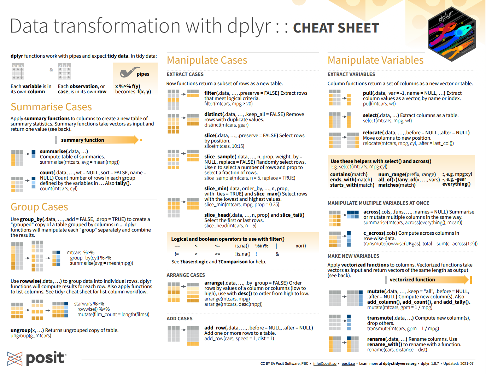
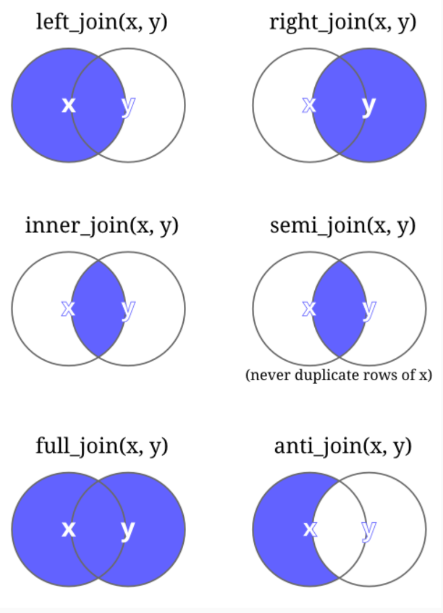

```{r setup, include=FALSE}
options(htmltools.dir.version = FALSE)
knitr::opts_chunk$set(
  fig.width=9, fig.height=3.5, fig.retina=3,
  out.width = "100%",
  cache = FALSE,
  echo = TRUE,
  message = FALSE, 
  warning = FALSE,
  hiline = TRUE
)
```

```{r xaringan-themer, include=FALSE, warning=FALSE}
xaringanthemer::style_duo_accent(
  primary_color = "#005c8b",
  secondary_color = "#0073ae",
  inverse_header_color = "#FFFFFF"
)
```

```{r xaringanExtra, echo=FALSE}
#devtools::install_github("gadenbuie/xaringanExtra")
# xaringanExtra::use_xaringan_extra(c("tile_view", "animate_css", "tachyons"))

xaringanExtra::use_clipboard()

xaringanExtra::use_fit_screen()

xaringanExtra::use_extra_styles(
  hover_code_line = TRUE,         #<<
  mute_unhighlighted_code = TRUE  #<<
)


```

```{r xaringanExtra-share-again, echo=FALSE}
xaringanExtra::use_share_again()
```

<!-- inicio font awesome -->
<script src="https://kit.fontawesome.com/1f72d6921a.js" crossorigin="anonymous"></script>
<!-- final font awesome -->

<!-- inicio github buttons  -->
<script async defer src="https://buttons.github.io/buttons.js"></script>
<!-- final github buttons  -->


.pull-left[
<br>
<br>
<br>
<br>
<br>
## Análises Econométricas

### Manipulação de Dados

**[Luísa Gisele Böck](https://luisa.rbind.io/)**&nbsp;&nbsp;    <a href='mailto:luisa.bock@acad.ufsm.br'><i class="far fa-envelope"></i></a>    <a href='https://twitter.com/lgiselebock'><i class="fab fa-twitter"></i>   <a href='https://github.com/lgiselebock'><i class="fab fa-github"></i></a>

__.can-edit[Junho de 2023]__

]

.pull-right[
<br>
<br>
<br>
<br>
```{r echo=FALSE, out.width="400px"}
knitr::include_graphics("img/slides/26-intro-allison-horst-03.png")
```

.center[Ilustração por [Allison Horst](https://allisonhorst.com/)]
]

---

### Pipe:  %>% ou |>  

- `CTRL` + `SHIFT` + `M`: cria o &nbsp; `%>%` &nbsp; (ou `|>`).

Imagine uma receita de bolo: 

```{r, eval = FALSE, include = TRUE}
esfrie(
  asse(
    coloque(
      bata(
        acrescente(
          recipiente(rep("farinha", 2), "água", 
                     "fermento", "leite", "óleo"), 
          "farinha", até = "macio"), 
        duração = "3min"), 
      lugar = "forma", tipo = "grande", 
      untada = TRUE), duração = "50min"), 
  "geladeira", "20min")
```

Assim, é preciso pensar **de dentro para fora**. O primeiro comando lido é `esfrie`, sendo que essa é a última operação que será realizada.

Complicado, né? Veja como a mesma receita é escrita usando o operador `%>%`:

<div class="my-header">Fonte: <a href="https://abjur.github.io/r4jurimetrics/pipe.html">R para Jurimetria</a></div>

---

### Pipe:  %>% ou |>  

- `CTRL` + `SHIFT` + `M`: cria o &nbsp; `%>%` &nbsp; (ou `|>`).

Receita de bolo escrita com o `%>%`:

```{r, eval = FALSE, include = TRUE}
recipiente(rep("farinha", 2), "água", "fermento", "leite", "óleo") %>%
  acrescente("farinha", até = "macio") %>%
  bata(duração = "3min") %>%
  coloque(lugar = "forma", tipo = "grande", untada = TRUE) %>%
  asse(duração = "50min") %>%
  esfrie("geladeira", "20min")
```

Agora o código possui uma leitura muito mais intuitiva!

Pense no `%>%` como um operador que efetua as operações à direita nos valores que estão à esquerda, ou seja, ele passa o que está à esquerda como argumento para a operação da direita.

.footnote[Para mais informações e exemplos de utilização do `%>%`, visite [Ceci n’est pas un pipe](https://cran.r-project.org/web/packages/magrittr/vignettes/magrittr.html). Desde a versão 4.1 do `R`, foi disponibilizado o operador `pipe` (`|>`) nativo. Para mais informações, acesse [New features in R 4.1.0](https://www.jumpingrivers.com/blog/new-features-r410-pipe-anonymous-functions/).]

<div class="my-header">Fonte: <a href="https://beatrizmilz.github.io/2020-R-Ladies-SP-Basico/#1">R-Ladies São Paulo</a> e <a href="https://abjur.github.io/r4jurimetrics/pipe.html">R para Jurimetria</a></div>

---

class: inverse center middle

# Manipulação de dados

.center[(Acompanhe no arquivo `03-manipulacao.R`)]

---

Os exemplos apresentados aqui serão das bases abaixo:

```{r}
library(tidyverse)

pinguins <- read_csv("dados/pinguins/pinguins.csv")
pinguins_raw <- read_csv("dados/pinguins/pinguins_raw.csv")
```

----

```{r echo=FALSE}
head(pinguins, n = 3)
```

```{r echo=FALSE}
head(pinguins_raw, n = 3)
```

---

### Pacote &nbsp; `dplyr`

É o pacote mais útil para realizar a manipulação dos dados, pois possui funções para fazer qualquer tipo de transformação nas linhas e nas colunas da base.

As principais funções do `dplyr` são:

- `filter()`: filtra as linhas
- `select()`: seleciona as colunas
- `arrange()`: ordena as linhas conforme os valores de uma coluna
- `mutate()`: modifica ou cria novas colunas
- `group_by()`: agrupa a base conforme uma coluna
- `summarise()`: sumariza (resume) as colunas
- `left_join()`: junta tabelas


Todas essas funções seguem as seguintes características:

- A função sempre recebe uma `tibble` e sempre retorna uma `tibble`.

- A `tibble` é colocada no primeiro argumento e o que se quer fazer nos demais argumentos.

<div class="my-header">Fonte: <a href="https://curso-r.github.io/main-r4ds-1/slides/04-manipulacao.html">Curso-R</a></div>

---

### [Cheat Sheets](https://posit.co/resources/cheatsheets/) 

[](https://posit.co/resources/cheatsheets/)

---

### Selecionando Colunas:  &nbsp; `select()`

O primeiro argumento da função é a base de dados e os demais argumentos são os nomes das colunas que se quer selecionar. *Repare que não se coloca o nome da coluna entre aspas.*

```{r}
select(pinguins, species)
```

<div class="my-header">Fonte: <a href="https://curso-r.github.io/main-r4ds-1/slides/04-manipulacao.html">Curso-R</a></div>

---

### Selecionando Colunas:  &nbsp; `select()`

Também é possível selecionar várias colunas.

```{r}
select(pinguins, species, sex, body_mass_g)
```


<div class="my-header">Fonte: <a href="https://curso-r.github.io/main-r4ds-1/slides/04-manipulacao.html">Curso-R</a></div>

---

### Selecionando Colunas:  &nbsp; `select()`

O operador `:` é muito útil para selecionar colunas consecutivas.

```{r}
select(pinguins, island:body_mass_g)
```


<div class="my-header">Fonte: <a href="https://curso-r.github.io/main-r4ds-1/slides/04-manipulacao.html">Curso-R</a></div>

---

### Selecionando Colunas:  &nbsp; `select()`

O `dplyr` possui um conjunto de funções auxiliares úteis para a seleção de colunas.

- `starts_with()`: para colunas que começam com um texto padrão <br>
- `ends_with()`: para colunas que terminam com um texto padrão <br>
- `contains()`: para colunas que contêm um texto padrão <br>

```{r}
select(pinguins, ends_with("mm"))
```

<div class="my-header">Fonte: <a href="https://curso-r.github.io/main-r4ds-1/slides/04-manipulacao.html">Curso-R</a></div>

---

### Selecionando Colunas:  &nbsp; `select()`

A(s) coluna(s) pode(m) ser excluída(s) inserindo o caracter `-` na frente da(s) coluna(s).

```{r}
select(pinguins, -year)
```

<div class="my-header">Fonte: <a href="https://curso-r.github.io/main-r4ds-1/slides/04-manipulacao.html">Curso-R</a></div>

---

### Selecionando Colunas:  &nbsp; `select()`

A(s) coluna(s) pode(m) ser excluída(s) inserindo o caracter `-` na frente do vetor de colunas.

```{r}
select(pinguins, -c(year, sex))
```

<div class="my-header">Fonte: <a href="https://curso-r.github.io/main-r4ds-1/slides/04-manipulacao.html">Curso-R</a></div>

---

### Ordenando linhas: &nbsp; `arrange()`

Serve para ordenar as linhas. O primeiro argumento é a base de dados, e os demais argumentos são as colunas pelas quais serão ordenadas as linhas. Nesse exemplo, são ordenadas as linhas por *ordem crescente* da massa corporal dos pinguins.

```{r}
arrange(pinguins, body_mass_g)
```

<div class="my-header">Fonte: <a href="https://curso-r.github.io/main-r4ds-1/slides/04-manipulacao.html">Curso-R</a></div>

---

### Ordenando linhas: &nbsp; `arrange()`

É possível ordenar de forma decrescente usando a função `desc()` como argumento da função `arrange()`. Aqui, são ordenadas as linhas da base por *ordem decrescente* da massa corporal dos pinguins.

```{r}
arrange(pinguins, desc(body_mass_g))
```

<div class="my-header">Fonte: <a href="https://curso-r.github.io/main-r4ds-1/slides/04-manipulacao.html">Curso-R</a></div>

---

### Ordenando linhas: &nbsp; `arrange()`

Também é possível ordenar segundo duas ou mais colunas. Por exemplo, as linhas da base serão ordenadas de forma decrescente para o comprimento do bico e crescente para a profundidade do bico dos pinguins.

```{r}
arrange(pinguins, desc(bill_length_mm), bill_depth_mm)
```

<div class="my-header">Fonte: <a href="https://curso-r.github.io/main-r4ds-1/slides/04-manipulacao.html">Curso-R</a></div>

---

### Aplicando mais de uma função

Na maioria dos casos, é aplicado mais de uma função na manipulação de uma base. Por exemplo, pode-se querer uma tabela apenas com a espécie dos pinguins e a massa corporal ordenada crescentemente.

```{r eval = FALSE}
arrange(select(pinguins, species, body_mass_g), body_mass_g)
```

A solução para aplicar diversas operações é utilizar o operador `pipe`: `%>%`

```{r eval = FALSE}
pinguins %>% 
  select(species, body_mass_g) %>% 
  arrange(body_mass_g)
```

O que está acontecendo no código com o `pipe`? Da primeira para a segunda linha, aplicamos a função `select()` à base "pinguins". Da segunda para a terceira linha, utilizamos a função `arrange()` à base resultante da função `select()`.

<div class="my-header">Fonte: <a href="https://curso-r.github.io/main-r4ds-1/slides/04-manipulacao.html">Curso-R</a></div>

---

### Filtrando linhas: &nbsp; `filter()`

Filtra valores (linhas) de uma coluna da base. Aqui, foram filtradas as linhas que possuem comprimento da nadadeira superior à 140 mm.

```{r}
filter(pinguins, flipper_length_mm > 140)
```

<div class="my-header">Fonte: <a href="https://curso-r.github.io/main-r4ds-1/slides/04-manipulacao.html">Curso-R</a></div>

---

### Filtrando linhas: &nbsp; `filter()`

É possível selecionar apenas as colunas da espécie e do comprimento da nadadeira, filtrando apenas aqueles com comprimento de nadadeira superior a 140 mm.

```{r}
pinguins %>% 
  select(species, flipper_length_mm) %>% 
  filter(flipper_length_mm > 140)
```


<div class="my-header">Fonte: <a href="https://curso-r.github.io/main-r4ds-1/slides/04-manipulacao.html">Curso-R</a></div>

---

### Filtrando linhas: &nbsp; `filter()`

Estendendo o filtro para duas ou mais colunas. Para isso, cada operação é separada por uma vírgula. O código abaixo retorna uma tabela com todos os pinguins da ilha de Torgersen com profundidade de bico maior que 15 mm.

```{r}
pinguins %>% 
  filter(island == "Torgersen", bill_depth_mm > 15)
```

<div class="my-header">Fonte: <a href="https://curso-r.github.io/main-r4ds-1/slides/04-manipulacao.html">Curso-R</a></div>

---

### Filtrando linhas: &nbsp; `filter()`

Também é possível realizar operações com as colunas da base dentro da função `filter()`. No exemplo abaixo, é devolvido uma tabela com os pinguins que possuem massa corporal maior que a média da massa corporal.

```{r}
pinguins %>% 
  filter(body_mass_g > mean(body_mass_g, na.rm = TRUE))
```

<div class="my-header">Fonte: <a href="https://curso-r.github.io/main-r4ds-1/slides/04-manipulacao.html">Curso-R</a></div>

---

### Criando novas colunas: &nbsp; `mutate()`

Utilizado para modificar uma coluna já existente ou para criar uma nova coluna. O código a seguir divide os valores da coluna `bill_length_mm` por 10, alterando a unidade de medida dessa variável de milímetros (mm) para centímetros (cm).

```{r}
pinguins %>% 
  mutate(bill_length_mm = bill_length_mm/10)
```

<div class="my-header">Fonte: <a href="https://curso-r.github.io/main-r4ds-1/slides/04-manipulacao.html">Curso-R</a></div>

---

### Criando novas colunas: &nbsp; `mutate()`

Também é possível criar a variável anterior em uma nova coluna, mantendo a variável original. A coluna `bill_length_cm` é colocada no final da tabela.

```{r}
pinguins %>% 
  mutate(bill_length_cm = bill_length_mm/10)
```

<div class="my-header">Fonte: <a href="https://curso-r.github.io/main-r4ds-1/slides/04-manipulacao.html">Curso-R</a></div>

---

### Criando novas colunas: &nbsp; `mutate()`

Podemos realizar qualquer operação com uma ou mais colunas. A única regra é que o resultado da operação devolva um vetor com comprimento exatamente igual ao número de linhas da base (ou com comprimento 1 pra distribuir o mesmo valor em todas as linhas). Também é possível criar/modificar quantas colunas quiser dentro de um mesmo `mutate()`.

```{r}
pinguins %>% 
  mutate(
    mean_bill_length_mm = mean(bill_length_mm, na.rm = TRUE),
    country = "Antarctica"
  ) %>% 
  select(species, mean_bill_length_mm, country)
```

<div class="my-header">Fonte: <a href="https://curso-r.github.io/main-r4ds-1/slides/04-manipulacao.html">Curso-R</a></div>

---

### Sumarizando colunas: &nbsp; `summarise()`

Sumarização é a técnica de resumir um conjunto de dados utilizando alguma métrica de interesse. A média, a mediana, a variância, a frequência e a proporção, por exemplo, são tipos de sumarização que trazem diferentes informações sobre uma variável. O código abaixo resume a coluna massa corporal pela sua média.

```{r}
pinguins %>% 
  summarise(mean_body_mass_g = mean(body_mass_g, na.rm = TRUE))
```

<div class="my-footer">Também pode ser usado a função <code>summarize()</code>.</div>

<div class="my-header">Fonte: <a href="https://curso-r.github.io/main-r4ds-1/slides/04-manipulacao.html">Curso-R</a></div>

---

### Sumarizando colunas: &nbsp; `summarise()`

Diversas sumarizações diferentes podem ser realizadas em um mesmo `summarise()`. Cada sumarização (resumo) será uma coluna da nova base.

```{r}
pinguins %>% 
  summarise(
    mean_flipper_length_mm = mean(flipper_length_mm, na.rm = TRUE),
    median_flipper_length_mm = median(flipper_length_mm, na.rm = TRUE),
    var_flipper_length_mm = var(flipper_length_mm, na.rm = TRUE)
  )
```

<div class="my-footer">Também pode ser usado a função <code>summarize()</code>.</div>

<div class="my-header">Fonte: <a href="https://curso-r.github.io/main-r4ds-1/slides/04-manipulacao.html">Curso-R</a></div>

---

### Sumarizando colunas: &nbsp; `summarise()`

Também é possível sumarizar (resumir) colunas diferentes.

```{r}
pinguins %>% 
  summarise(
    mean_flipper_length_mm = mean(flipper_length_mm, na.rm = TRUE),
    mean_bill_length_mm = mean(bill_length_mm, na.rm = TRUE),
    mean_bill_depth_mm = median(bill_depth_mm, na.rm = TRUE)
  )
```

<div class="my-footer">Também pode ser usado a função <code>summarize()</code>.</div>

<div class="my-header">Fonte: <a href="https://curso-r.github.io/main-r4ds-1/slides/04-manipulacao.html">Curso-R</a></div>

---

### Sumarizando colunas agrupadas

Em muitas ocasiões, é preciso sumarizar uma coluna agrupada por categorias de uma segunda coluna. Para isso, além do `summarise()`, também é utilizado a função `group_by()`.

O código abaixo calcula a média da massa corporal para cada categoria da coluna "ilha".

```{r}
pinguins %>% 
  group_by(island) %>% 
  summarise(
    mean_body_mass_g = mean(body_mass_g, na.rm = TRUE)
  ) %>% 
  arrange(desc(mean_body_mass_g))
```

<div class="my-footer">Também pode ser usado a função <code>summarize()</code>.</div>

<div class="my-header">Fonte: <a href="https://curso-r.github.io/main-r4ds-1/slides/04-manipulacao.html">Curso-R</a></div>

---

### Sumarizando colunas agrupadas: &nbsp; `group_by()`

A única alteração que a função `group_by()` faz na base é a marcação de que a base está agrupada.

```{r}
pinguins %>% 
  group_by(island)
```

<div class="my-header">Fonte: <a href="https://curso-r.github.io/main-r4ds-1/slides/04-manipulacao.html">Curso-R</a></div>

---

### Ordenando colunas:  &nbsp;  `relocate()`

Reordena as colunas por nome ou posição. Nesse caso, a função `relocate()` alterou a posição das colunas sexo e ano para depois da coluna ilha.

```{r}
pinguins %>% 
  relocate(sex, year, .after = island)
```

<div class="my-header">Fonte: <a href="https://mauriciovancine.github.io/course-geospatial-data-r/01_slides/04_slides_intro_geoespacial_r.html#1">Maurício H. Vancine</a> e <a href="https://rpubs.com/williamsurles/293454">William Surles</a></div>

---

### Renomeando colunas: &nbsp; `rename()`

Renomeia as colunas de uma tabela. O primeiro argumento da função `rename()` corresponde ao nome que se deseja colocar na coluna, e o segundo argumento é o nome atual da coluna.

```{r}
pinguins %>% 
  rename(
    comprimento_bico_mm = bill_length_mm,
    profundidade_bico_mm = bill_depth_mm,
    comprimento_nadadeira_mm = flipper_length_mm,
    massa_corporal_g = body_mass_g
  )
```

<div class="my-header">Fonte: <a href="https://mauriciovancine.github.io/course-geospatial-data-r/01_slides/04_slides_intro_geoespacial_r.html#1">Maurício H. Vancine</a> e <a href="https://rpubs.com/williamsurles/293454">William Surles</a></div>

---

### Selecionando linhas: &nbsp; `slice_head()`

Seleciona as primeiras linhas da tabela. O argumento `n =` indica a quantidade de linhas selecionadas.

```{r}
pinguins %>% 
  slice_head(n = 8)
```

<div class="my-header">Fonte: <a href="https://mauriciovancine.github.io/course-geospatial-data-r/01_slides/04_slides_intro_geoespacial_r.html#1">Maurício H. Vancine</a> e <a href="https://rpubs.com/williamsurles/293454">William Surles</a></div>

---

### Selecionando linhas: &nbsp; `slice_max()`

Seleciona linhas por valores de uma coluna. O argumento `n =` retorna o número de linhas +1; se o `n =` não for informado, retorna apenas 1 linha.

```{r}
pinguins %>% 
  slice_max(bill_depth_mm, n = 5)
```

<div class="my-header">Fonte: <a href="https://mauriciovancine.github.io/course-geospatial-data-r/01_slides/04_slides_intro_geoespacial_r.html#1">Maurício H. Vancine</a> e <a href="https://rpubs.com/williamsurles/293454">William Surles</a></div>

---

### Selecionando linhas: &nbsp; `slice_sample()`

Seleciona as linhas aleatoriamente. O argumento `n =` retorna a quantidade de linhas.

```{r}
pinguins %>% 
  slice_sample(n = 12)
```

<div class="my-header">Fonte: <a href="https://mauriciovancine.github.io/course-geospatial-data-r/01_slides/04_slides_intro_geoespacial_r.html#1">Maurício H. Vancine</a> e <a href="https://rpubs.com/williamsurles/293454">William Surles</a></div>

---

### Limpando a tabela: &nbsp; `distinct()`

Retira as linhas com valores duplicados com base nos valores das colunas, mas mantendo as colunas.

```{r}
pinguins %>% 
  distinct(body_mass_g, .keep_all = TRUE)
```

<div class="my-header">Fonte: <a href="https://mauriciovancine.github.io/course-geospatial-data-r/01_slides/04_slides_intro_geoespacial_r.html#1">Maurício H. Vancine</a> e <a href="https://rpubs.com/williamsurles/293454">William Surles</a></div>

---

### Contando valores: &nbsp; `count()`

Conta valores de uma tabela, geralmente para variáveis categóricas

```{r}
pinguins %>% 
  count(species)
```

<div class="my-header">Fonte: <a href="https://mauriciovancine.github.io/course-geospatial-data-r/01_slides/04_slides_intro_geoespacial_r.html#1">Maurício H. Vancine</a> e <a href="https://rpubs.com/williamsurles/293454">William Surles</a></div>

---

### Contando valores: &nbsp; `count()`

Conta valores de mais de uma coluna, geralmente para variáveis categóricas

```{r}
pinguins %>% 
  count(species, island)
```

<div class="my-header">Fonte: <a href="https://mauriciovancine.github.io/course-geospatial-data-r/01_slides/04_slides_intro_geoespacial_r.html#1">Maurício H. Vancine</a> e <a href="https://rpubs.com/williamsurles/293454">William Surles</a></div>

---

### Combinando dados: &nbsp; `bind_rows()`

Combina dados por linhas.

```{r}
# selecionar as linhas para dois tibbles
pinguins_01 <- slice(pinguins, 1:5) %>% select(1:3)
pinguins_02 <- slice(pinguins, 51:55) %>% select(4:6)

# combinar as linhas
bind_rows(pinguins_01, pinguins_02, .id = "id")
```

<div class="my-header">Fonte: <a href="https://mauriciovancine.github.io/course-geospatial-data-r/01_slides/04_slides_intro_geoespacial_r.html#1">Maurício H. Vancine</a> e <a href="https://rpubs.com/williamsurles/293454">William Surles</a></div>

---

### Combinando dados: &nbsp; `bind_cols()`

Combina dados por colunas.

```{r}
# selecionar as linhas para dois tibbles
pinguins_01 <- slice(pinguins, 1:5)
pinguins_02 <- slice(pinguins, 51:55)

## combinar as colunas
bind_cols(pinguins_01, pinguins_02, .name_repair = "unique")
```

<div class="my-header">Fonte: <a href="https://mauriciovancine.github.io/course-geospatial-data-r/01_slides/04_slides_intro_geoespacial_r.html#1">Maurício H. Vancine</a> e <a href="https://rpubs.com/williamsurles/293454">William Surles</a></div>

---

### Unindo bases: &nbsp; `*_join()`

Combina pares de dados tabulares por uma ou mais chaves.

.left-column[
<br>
<br>
<br>
<br>
```{r echo=FALSE, out.width="100%"}

```

] 

.right-column[

<b>Junção de mutação</b>

- `left_join(x, y)`: mantém as observações em x
- `right_join(x, y)`: mantém as observações em y
- `inner_join(x, y)`: mantém apenas as observações em x e em y
- `full_join(x, y)`: mantém todas as observações em x e em y

<b>Junção de filtragem</b>

- `semi_join(x, y)`: mantém as observações em x que têm uma correspondência em y
- `anti_join(x, y)`: elimina as observações em x que têm uma correspondência em y

]

<div class="my-header">Fonte: <a href="https://mauriciovancine.github.io/course-geospatial-data-r/01_slides/04_slides_intro_geoespacial_r.html#1">Maurício H. Vancine</a> e <a href="https://rpubs.com/williamsurles/293454">William Surles</a></div>

---

### Unindo bases: &nbsp; `*_join()`

.pull-left[

```{r echo=FALSE, out.width="85%"}
knitr::include_graphics("img/slides/38-left-join.gif")
```


```{r echo=FALSE, out.width="85%"}
knitr::include_graphics("img/slides/40-inner-join.gif")
```

]

.pull-right[

```{r echo=FALSE, out.width="85%"}
knitr::include_graphics("img/slides/39-right-join.gif")
```


```{r echo=FALSE, out.width="85%"}
knitr::include_graphics("img/slides/41-full-join.gif")
```


]

<div class="my-header">Fonte: <a href="https://mauriciovancine.github.io/course-geospatial-data-r/01_slides/04_slides_intro_geoespacial_r.html#1">Maurício H. Vancine</a> e <a href="https://rpubs.com/williamsurles/293454">William Surles</a></div>

---

### Unindo bases: &nbsp; `*_join()`

Cria uma tabela com a longitude e a latitude das ilhas da tabela `pinguins`.

```{r}
## coordenadas
pinguins_ilhas <- tibble(
  ilha = c("Torgersen", "Biscoe", "Dream", "Alpha"),
  longitude = c(-64.083333, -63.775636, -64.233333, -63),
  latitude = c(-64.766667, -64.818569, -64.733333, -64.316667))

pinguins_ilhas
```

<div class="my-header">Fonte: <a href="https://mauriciovancine.github.io/course-geospatial-data-r/01_slides/04_slides_intro_geoespacial_r.html#1">Maurício H. Vancine</a> e <a href="https://rpubs.com/williamsurles/293454">William Surles</a></div>

---

### Unindo bases: &nbsp; `left_join()`

Agora, une as tabelas `pinguins` e `pinguins_ilhas`. A tabela final será a tabela original (`pinguins`), acrescida da tabela com os dados de latitude e longitude das ilhas (`pinguins_ilhas`).

```{r}
pinguins_left_join <- left_join(
  pinguins, pinguins_ilhas, by = c("island" = "ilha")
)
glimpse(pinguins_left_join)
```

<div class="my-header">Fonte: <a href="https://mauriciovancine.github.io/course-geospatial-data-r/01_slides/04_slides_intro_geoespacial_r.html#1">Maurício H. Vancine</a> e <a href="https://rpubs.com/williamsurles/293454">William Surles</a></div>

---

### Operações de conjuntos e comparações de dados

.pull-left[

<b><font size = 5>Operações para comparar dos dados:</font></b>

- `union(x, y)`: retorna todas as linhas que aparecem em x, y ou mais dos conjuntos de dados
- `interesect(x, y)`: retorna apenas as linhas que aparecem em x e em y
- `setdiff(x, y)`: retorna as linhas que aparecem x, mas não em y
- `setequal(x, y)`: retorna se x e y são iguais e quais suas diferenças

]

.pull-right[
<br>
<br>
```{r echo=FALSE, out.width="85%"}
knitr::include_graphics("img/slides/43-operacoes.png")
```

]

<div class="my-header">Fonte: <a href="https://mauriciovancine.github.io/course-geospatial-data-r/01_slides/04_slides_intro_geoespacial_r.html#1">Maurício H. Vancine</a> e <a href="https://rpubs.com/williamsurles/293454">William Surles</a></div>

---

### Pacote &nbsp; `tidyr`

**Tidy data:**

```{r echo=FALSE, out.width="100%", fig.align='center'}
knitr::include_graphics("img/slides/23-tidy-data.png")
```

Dados organizados são uma forma padrão de mapear o significado de um conjunto de dados em sua estrutura. Em dados organizados:

- cada coluna é uma variável;

- cada linha é uma observação;

- cada célula é um único valor.

<div class="my-header">Fonte: <a href="https://bookdown.org/bruno_lucian_costa/CursoIntermediarioR/">Análise de Dados em R - Nível Intermediário</a></div>

---

### Pacote &nbsp; `tidyr`

O pacote `tidyr` tem a função de tornar um conjunto de dados tidy (organizados), sendo esses fáceis de manipular, modelar e visualizar.

Um conjunto de dados está arrumado ou não, dependendo de como linhas, colunas e células são combinadas com observações, variáveis e valores.

As principais funções do `tidyr` são:

- `unite()`: junta dados de múltiplas colunas em uma
- `separate()`: separa caracteres em múlplica colunas
- `separate_rows()`: separa caracteres em múlplica colunas e linhas
- `drop_na()`: retira linhas com NA
- `replace_na()`: substitui NA
- `pivot_wider()`: long para wide
- `pivot_longer()`: wide para long

<div class="my-header">Fonte: <a href="https://mauriciovancine.github.io/course-geospatial-data-r/01_slides/04_slides_intro_geoespacial_r.html#1">Maurício H. Vancine</a></div>

---

### [Cheat Sheets](https://posit.co/resources/cheatsheets/) 

[](https://posit.co/resources/cheatsheets/)

---

### União de colunas: &nbsp; `unite()`

Une duas colunas em uma única coluna.

```{r}
especie_ilha <- pinguins %>% 
  unite(
    col = "especie_ilha", 
    species:island, 
    sep = " - "
  ) 

head(especie_ilha)
```


<div class="my-header">Fonte: <a href="https://mauriciovancine.github.io/course-geospatial-data-r/01_slides/04_slides_intro_geoespacial_r.html#1">Maurício H. Vancine</a></div>

---

### Separação de colunas: &nbsp; `separate()`

Separa uma coluna em duas ou mais colunas.


```{r}
especie_ilha %>% 
  separate(
    col = especie_ilha, into = c("especie", "ilha"), sep = " - ",
  )
  
```


<div class="my-header">Fonte: <a href="https://mauriciovancine.github.io/course-geospatial-data-r/01_slides/04_slides_intro_geoespacial_r.html#1">Maurício H. Vancine</a></div>

---

### Remove NAs: &nbsp; `drop_na()`

Remove as linhas que contém `NA` de todas as colunas.

```{r}
pinguins %>% 
  drop_na()
```


<div class="my-header">Fonte: <a href="https://mauriciovancine.github.io/course-geospatial-data-r/01_slides/04_slides_intro_geoespacial_r.html#1">Maurício H. Vancine</a></div>

---

### Pivotar os dados: &nbsp; `pivot_*()`

.pull-left[

**`pivot_longer()`:** torna os conjuntos de dados mais longos, aumentando o número de linhas e diminuindo o número de colunas. É comumente necessário para organizar conjuntos de dados capturados de forma 'selvagem', pois as tabelas, geralmente, são desenvolvidas para facilitar a entrada de dados ou facilitar a comparação, em vez de propiciar uma análise. 

**`pivot_wider()`:** torna um conjunto de dados mais amplo aumentando o número de colunas e diminuindo o número de linhas. É relativamente raro utilizar o `pivot_wider()` em dados organizados, mas pode ser útil na

]

.pull-right[

```{r echo=FALSE, out.width="100%", fig.align='center'}
knitr::include_graphics("img/slides/45-original-dfs-tidy.png")
```

criação de tabelas de resumo para apresentação ou dados em um formato necessário para outras ferramentas.

]


<div class="my-header">Fonte: <a href="https://mauriciovancine.github.io/course-geospatial-data-r/01_slides/04_slides_intro_geoespacial_r.html#1">Maurício H. Vancine</a></div>

---

### Larga para longa: &nbsp; `pivot_longer()`

***Wide* para *Long*:** o banco de dados se torna mais longo (`longer`) em relação aos dados originais. Os principais argumentos da função `pivot_longer()` são:

1. <b>cols:</b> colunas para girar em formato mais longo
2. <b>names_to:</b> nome da coluna que receberá os nomes
3. <b>values_to:</b> nome da coluna que receberá os valores

```{r}
pivot_longer(data = pinguins_raw[, c(2, 3, 10:13)],
             cols = `Culmen Length (mm)`:`Body Mass (g)`,
             names_to = "medidas",
             values_to = "valores")
```

<div class="my-header">Fonte: <a href="https://mauriciovancine.github.io/course-geospatial-data-r/01_slides/04_slides_intro_geoespacial_r.html#1">Maurício H. Vancine</a></div>

---

### Longa para larga: &nbsp; `pivot_wider()`

***Long* para *Wide*:** o banco de dados se torna mais largo (`wider`) em relação aos dados originais. Os principais argumentos da função `pivot_wider()` são:

1. <b>names_from:</b> variável categórica que definirá os nomes das colunas
2. <b>values_from:</b> variável numérica que preencherá os dados
3. <b>values_fill:</b> valor para preencher os NAs

```{r}
pivot_wider(
  data = pinguins_raw[, c(2, 3, 13)],
  names_from = Species,
  values_from = `Body Mass (g)`
)
```

<div class="my-header">Fonte: <a href="https://mauriciovancine.github.io/course-geospatial-data-r/01_slides/04_slides_intro_geoespacial_r.html#1">Maurício H. Vancine</a></div>

---

# Obrigada!

.pull-left[

```{r echo=FALSE, out.width="65%", fig.align='center'}
knitr::include_graphics("https://media.giphy.com/media/v1.Y2lkPTc5MGI3NjExNjFlNDgyOTRhMTk5MGE4ZTNmNjg5ZWMzM2NlZDU3ODBmZDU0OGFiNiZlcD12MV9pbnRlcm5hbF9naWZzX2dpZklkJmN0PWc/M9NbzZjAcxq9jS9LZJ/giphy.gif")
```

.center[Agradecimento especial à [Curso-R](https://curso-r.com/) e ao [Maurício Vancine](https://mauriciovancine.github.io/) pelos materiais.]

.center[Slides criados usando os pacotes em R:]
.center[[**xaringan**](https://github.com/yihui/xaringan)]
.center[[**xaringanthemer**](https://github.com/gadenbuie/xaringanthemer)]

.center[O chakra vem da biblioteca JavaScript [remark.js](https://remarkjs.com), [**knitr**](http://yihui.name/knitr), and [R Markdown](https://rmarkdown.rstudio.com).]
]

.pull-right[

```{r echo=FALSE, out.width="55%", fig.align='center'}
knitr::include_graphics("img/slides/19-luisa.jpg")
```

.center[<i class="fas fa-home"></i> [luisa.rbind.io](https://luisa.rbind.io/)]

.center[<i class="fab fa-twitter"></i> [@lgiselebock](https://twitter.com/lgiselebock)]

.center[<i class="fab fa-github"></i> [@lgiselebock](https://github.com/lgiselebock/)]

.center[<i class="far fa-envelope"></i> [luisa.bock@acad.ufsm.br](mailto:luisa.bock@acad.ufsm.br)]
]

<!-- inicio academic icons -->
<link rel="stylesheet" href="https://cdn.jsdelivr.net/gh/jpswalsh/academicons@1/css/academicons.min.css">
<!-- final academic icons -->

 
<!-- inicio font awesome -->
<script src="https://kit.fontawesome.com/1f72d6921a.js" crossorigin="anonymous"></script>

<!-- final font awesome -->

