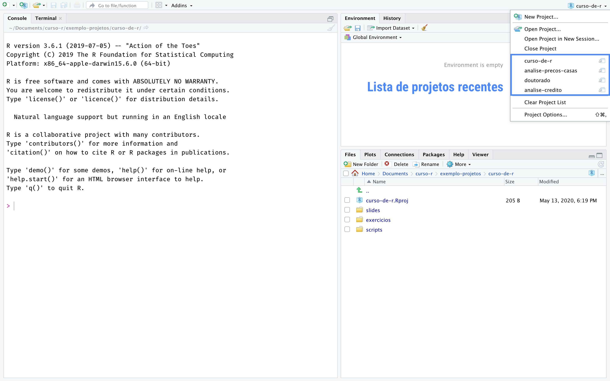
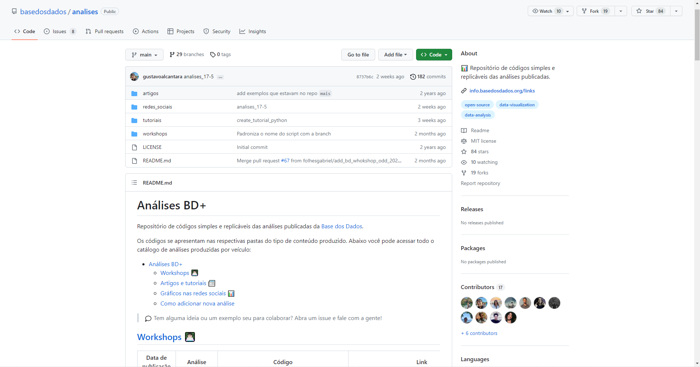
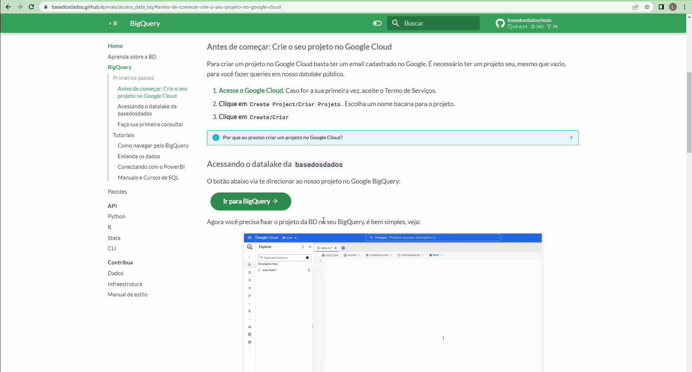
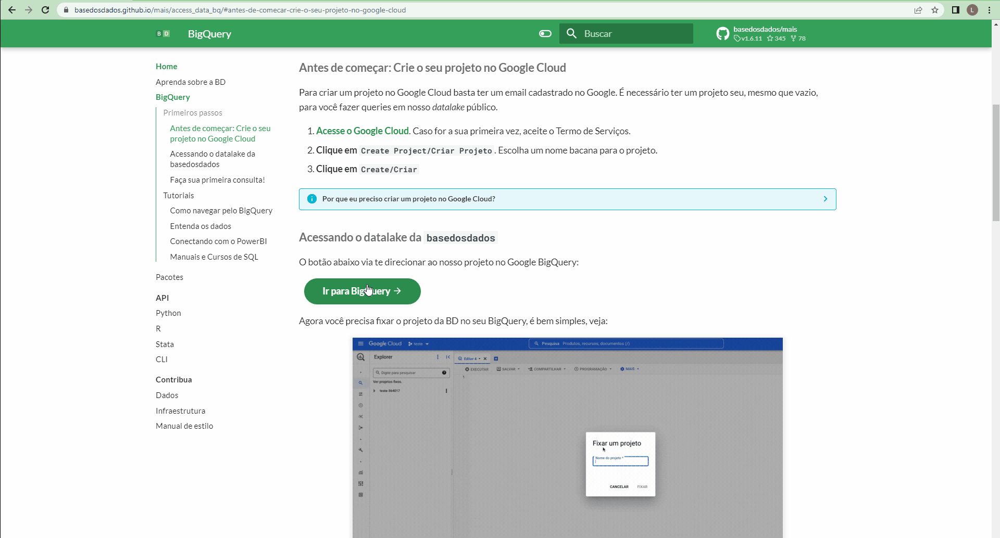

```{r setup, include=FALSE}
options(htmltools.dir.version = FALSE)
knitr::opts_chunk$set(
  fig.width=9, fig.height=3.5, fig.retina=3,
  out.width = "100%",
  cache = FALSE,
  echo = TRUE,
  message = FALSE, 
  warning = FALSE,
  hiline = TRUE
)
```

```{r xaringan-themer, include=FALSE, warning=FALSE}
xaringanthemer::style_duo_accent(
  primary_color = "#005c8b",
  secondary_color = "#0073ae",
  inverse_header_color = "#FFFFFF"
)
```

```{r xaringanExtra, echo=FALSE}
#devtools::install_github("gadenbuie/xaringanExtra")
# xaringanExtra::use_xaringan_extra(c("tile_view", "animate_css", "tachyons"))

xaringanExtra::use_clipboard()

xaringanExtra::use_fit_screen()

xaringanExtra::use_extra_styles(
  hover_code_line = TRUE,         #<<
  mute_unhighlighted_code = TRUE  #<<
)

xaringanExtra::use_panelset()
```

```{r xaringanExtra-share-again, echo=FALSE}
xaringanExtra::use_share_again()
```

<!-- inicio font awesome -->
<script src="https://kit.fontawesome.com/1f72d6921a.js" crossorigin="anonymous"></script>
<!-- final font awesome -->

<!-- inicio github buttons  -->
<script async defer src="https://buttons.github.io/buttons.js"></script>
<!-- final github buttons  -->


.pull-left[
<br>
<br>
<br>
<br>
<br>
## Análises Econométricas

### Importação de Dados

**[Luísa Gisele Böck](https://luisa.rbind.io/)**&nbsp;&nbsp;    <a href='mailto:luisa.bock@acad.ufsm.br'><i class="far fa-envelope"></i></a>    <a href='https://twitter.com/lgiselebock'><i class="fab fa-twitter"></i>   <a href='https://github.com/lgiselebock'><i class="fab fa-github"></i></a>

__.can-edit[Junho de 2023]__

]

.pull-right[
<br>
<br>
<br>
<br>
<br>
<br>
```{r echo=FALSE, out.width="500px"}
knitr::include_graphics("img/slides/27-intro-allison-horst-02.png")
```

.center[Ilustração por [Allison Horst](https://twitter.com/allison_horst/)]
]

---

### Projetos

Um projeto é uma pasta no seu computador. Nessa pasta estarão todos os arquivos que você usará ou criará na sua análise.

A principal razão para a utilização dos Projetos é a **organização**. Com eles, é muito mais fácil importar bases de dados para dentro do `R`, criar análises reprodutíveis e compartilhar o trabalho.

**Habitue-se, desde cedo, a criar um projeto para cada nova análise.**

Para **criar um projeto**, clique em `New Project` no Menu `File`. Na caixa de diálogo que aparecerá, clique em `New Directory` para criar o projeto em uma nova pasta ou `Existing Directory` para criar em uma pasta existente.

Ao criar um Projeto, o `RStudio` criará na pasta escolhida um arquivo `nome-do-projeto.Rproj`. É possível usar esse arquivo para iniciar o `RStudio` já com o respectivo projeto aberto.

.footnote[Com o `Git` instalado, pode usar projetos para conectar com repositórios do GitHub (p. ex.). Para isso, basta clicar `Version Control`. Para maiores informações, acesse o [Zen do R](https://blog.curso-r.com/posts/2019-07-23-zen-do-r-4/).]

<div class="my-header">Fonte: <a href="https://curso-r.github.io/main-r4ds-1/slides/02-introducao-ao-r.html">Curso-R</a></div>

---

### Projetos

**Criando um novo Projeto:**

```{r, echo=FALSE, out.width="100%", fig.align='center'}
knitr::include_graphics("img/slides/20-criar-projeto.gif")
```

<div class="my-header">Fonte: <a href="https://beatrizmilz.github.io/2020-R-Ladies-SP-Basico/#1">R-Ladies São Paulo</a></div>

---

### Projetos

**RStudio com um Projeto aberto:**

```{r, echo=FALSE, out.width="100%", fig.align='center'}
knitr::include_graphics("img/slides/21-exemplo-projeto-aberto.png")
```

<div class="my-header">Fonte: <a href="https://curso-r.github.io/main-r4ds-1/slides/02-introducao-ao-r.html">Curso-R</a></div>

---

### Projetos

**Navegando entre os Projetos:**

```{r, echo=FALSE, out.width="100%", fig.align='center'}

```

<div class="my-header">Fonte: <a href="https://curso-r.github.io/main-r4ds-1/slides/02-introducao-ao-r.html">Curso-R</a></div>

---

### Pacote: `tidyverse`

É uma coleção de pacotes de `R` desenvolvidos para a Ciência de Dados. 

Os pacotes do `tidyverse` compartilham uma mesma filosofia de desenvolvimento, sintaxe e estruturas de dados. 

Embora o `tidyverse` instale diversos outros pacotes, apenas esses são carrregados: 


|     **Pacote**    |                      **Função**                      |
|:-----------------:|:----------------------------------------------------:|
|      `tibble`     |               _data frames_ repaginados              |
|      `readr`      | leitura e importação de dados (e.g. `.csv` e `.txt`) |
| `tidyr` e `dplyr` |           arrumação e manipulação de dados           |
|     `stringr`     |                  trabalha com textos                 |
|     `forcats`     |                 trabalha com fatores                 |
|      `purrr`      |                 programação funcional                |
|     `ggplot2`     |           visualização de dados (gráficos)           |
  

<div class="my-header">Fonte: <a href="https://curso-r.github.io/main-r4ds-1/slides/02-introducao-ao-r.html">Curso-R</a></div>

---

class: inverse center middle

# Importação de dados

.center[(Acompanhe no arquivo `02-importacao.R`)]

---

### Caminhos

É importante na tarefa de *importação de dados* é saber onde está o arquivo que se quer importar. Toda função de importação vai exigir um caminho (uma string) que representa o endereço do arquivo no computador.

----

**Diretório de trabalho (*working directory*):**

É a parta em que o **R** vai procurar os arquivos na hora de ler informações ou gravar os arquivos na hora de salvar os objetos.

Se está dentro de um projeto, o diretório de trabalgo será, por padrão, a pasta raiz do projeto (é a pasta que contém o arquivo `.Rproj`).

Se não estiver usando um projeto ou não souber qual é o diretório de trabalho, é possível descobri-lo usando a função `getwd()`. Ela vai devolver uma string com o caminho do diretório de trabalho.

A função `setwd()` pode ser utilizada para mudar o diretório de trabalho. Como argumento, ela recebe o caminho para o novo diretório.

<div class="my-header">Fonte: <a href="https://curso-r.github.io/main-r4ds-1/slides/03-importacao.html">Curso-R</a></div>

---

### Caminhos

**Caminhos absolutos:**

São aqueles que têm início na pasta raiz do computador/usuário. Por exemplo: `"G:/Meu Drive/Repositorio/ufsm-monitoria-curso-r/"`.

Caminhos absolutos são uma **má prática**. Se você trocar de computador ou passar o script para outra pessoa rodar, o código não vai funcionar. Isso ocorre porque o caminho absoluto de um arquivo, muito provavelmente, será diferente entre os computadores.

----

**Caminhos relativos:**

São aqueles que têm início no diretório de trabalho da sessão. Usando o exemplo de caminho absoluto do slide anterior, o caminho relativo é: `/ufsm-monitoria-curso-r`.

O uso de caminhos relativos dentro de um projeto é considerado uma **boa prática**, pois quando a pasta do projeto for compartilhada com alguém, todos os caminhos existentes no código continuarão funcionando em qualquer computador.

<div class="my-header">Fonte: <a href="https://curso-r.github.io/main-r4ds-1/slides/03-importacao.html">Curso-R</a></div>

---

### Tibbles

São uma evolução da classe *Data Frame*. 

As funções do **`tidyverse`** para importação, arrumação e manipulação de bases devolvem sempre `tibbles` em vez de *data frames*.

Embora existam outras diferenças entre as classes, a mais importante é a forma como a tabela é mostrada no Console.

Quanto a isso, as diferenças são:

- `tibbles` mostram o número de linhas, o número de colunas e a classe das variáveis;

- `tibbles` mostram apenas as 10 primeiras linhas;

- `tibbles` mostram o número de colunas que couber na tela; e

- `tibbles` não nomeiam linhas (`row.names`).


<div class="my-header">Fonte: <a href="https://curso-r.github.io/main-r4ds-1/slides/03-importacao.html">Curso-R</a></div>

---

### Tibbles

**Exemplo: base `mtcars` como *data frame*:**

<br>

```{r, echo = FALSE}
head(mtcars, n = 15)
```

---

### Tibbles

**Exemplo: base `mtcars` como *tibble*:**

```{r}
tibble::as_tibble(mtcars)
```

Perceba que a coluna com os modelos dos veículos é excluída na `tibble`. Isso acontece porque, apesar de parecer uma coluna no *Data Frame*, ela não é considerada na `tibble`.

---

### Tibbles

**Exemplo: base `mtcars` como *tibble*:**

Uma maneira de adicionar a coluna com os modelos dos veículos é adicionar o argumento `rownames = "nome_da_coluna"` na função `as_tibble`. Assim, a nova `tibble` possuirá 12 colunas, uma a mais se comparada com a anterior.

```{r}
tibble::as_tibble(mtcars, rownames = "cars")
```

---

### Importação de arquivos

- Pacote `readr`: utilizados para ler arquivos de texto

  - `read_csv`
  - `read_csv2`
  - `read_delim`
  - `read_log`
  - `read_rds`
  
<br>
  
- Pacote `readxl`: utilizado para ler arquivos Excel

  - `read_excel`
  
<br>
  
- Pacote `heaven`: utilizado para ler arquivos de outros *softwares* estatísticos

  - `read_sas`
  - `read_spss`
  - `read_stata`

<div class="my-header">Fonte: <a href="https://beatrizmilz.github.io/2020-R-Ladies-SP-Basico/#1">R-Ladies São Paulo</a></div>

---

### Importação de arquivos

Para ler arquivos de texto (`.csv` ou `.txt`), são utilizadas funções do pacote `readr`.

Como exemplo, vamos utilizar a base dos Pinguins, originalmente disponibilizado no pacote [`palmerpenguins`](https://allisonhorst.github.io/palmerpenguins/), mas que também pode ser encontrado traduzido para o português no pacote [`dados`](https://cienciadedatos.github.io/dados/). 

Vamos importar essa base para o **R** lendo o arquivo `pinguins.csv` que está dentro da pasta "dados". Para isso, utilizamos a função `read_csv()`. Se o arquivo estiver bem formatado, a função só precisará do caminho até o arquivo para funcionar.

```{r}
library(readr) # carrega o pacote responsável pela importação

pinguins_csv <- read_csv("dados/pinguins/pinguins.csv")
```

<div class="my-header">Fonte: <a href="https://curso-r.github.io/main-r4ds-1/slides/03-importacao.html">Curso-R</a></div>

---

### Importação de arquivos

O objeto resultante será uma `tibble`:

```{r}
pinguins_csv
```

---

### Importação de arquivos

Em alguns países, como o Brasil, as vírgulas são utilizadas para separar as casas decimais dos números, inviabilizando os arquivos `.csv`.

Nesses casos, os arquivos `.csv` são separados por ponto-e-vírgula (;). Para ler essas bases no R, basta usar a função `read_csv2()`.

```{r}
pinguins_csv2 <- read_csv2("dados/pinguins/pinguins2.csv")
```

----

Arquivos `.txt` podem ser lidos com a função `read_delim()`. Nesse caso, além do caminho até o arquivo, é preciso indicar qual é o caractere utilizado para separar as colunas da base.

Um arquivo separado por tabulação, por exemplo, pode ser lido utilizando o código abaixo. O código `\t` é uma forma textual de representar a tecla  `TAB`.

```{r}
pinguins_txt <- read_delim("dados/pinguins/pinguins.txt", delim = "\t")
```


<div class="my-header">Fonte: <a href="https://curso-r.github.io/main-r4ds-1/slides/03-importacao.html">Curso-R</a></div>

---

### Importação de arquivos

**Arquivos Excel:**

Para ler planilhas do Excel (arquivos `.xlsx` ou `.xls`) utilizamos a função `read_excel()` do pacote `readxl`. Como esse pacote não consta no `tidyverse`, instale ele antes caso ainda não tenha instalado.

```{r eval = FALSE, include = TRUE}
install.packages("readxl") # instalar o pacote

library(readxl) # carrega o pacote

pinguins_xlsx <- read_excel("dados/pinguins/pinguins.xlsx")
```

```{r echo=FALSE, out.width="60%", fig.align='center'}
knitr::include_graphics("img/slides/25-importarexcel.gif")
```


<!-- <div class="my-header">Fonte: <a href="https://curso-r.github.io/main-r4ds-1/slides/03-importacao.html">Curso-R</a></div> -->

<div class="my-header">Fonte: <a href="https://curso-r.github.io/main-r4ds-1/slides/03-importacao.html">Curso-R</a> e <a href="https://beatrizmilz.github.io/2020-R-Ladies-SP-Basico/#1">R-Ladies São Paulo</a></div>

---

### Importação de arquivos

**Argumentos úteis:**

Como essas planilhas são facilmente editáveis, é comum recebermos bases de dados desconfiguradas, isto é, em um formato que o **R** não consegue importar. 

Para não precisarmos arrumar o arquivo na mão, correndo o risco de cometermos algum erro e alterarmos algum dado, a função `read_excel()` tem alguns argumentos úteis para essa situação:

- `sheet =` para definir em qual aba estão os dados;

- `col_names =` indica se a primeira linha representa o nome das colunas;

- `col_types =` define a classe das colunas;

- `skip =` pular linhas; e

- `NA =` indica quais strings devem ser interpretadas como `NA`.


<div class="my-header">Fonte: <a href="https://curso-r.github.io/main-r4ds-1/slides/03-importacao.html">Curso-R</a></div>

---

### Exportação de arquivos

Exportar objetos do **R** significa gravar as bases (ou objetos) em um arquivo no disco rígido (HD).

Geralmente, para cada função `read_*()` existe uma função `write_*()`. As funções de escrita são bem simples: é preciso passar para elas o objeto que quer gravar e o caminho/nome do arquivo que será criado (ou sobrescrito). **O nome do arquivo deve conter a extensão**.

```{r eval = FALSE, include = TRUE}
library(readr) # pacote necessário

# CSV (vírgula) e CSV2 (ponto-e-vírgula)
write_csv(pinguins, "dados/pinguins/pinguins.csv")
write_csv2(pinguins, "dados/pinguins/pinguins2.csv")

# TXT por tabulação
write_delim(pinguins, "dados/pinguins/pinguins.txt", delim = "\t")

library(writexl) # pacote necessário

# EXCEL
write_xlsx(pinguins, "dados/pinguins/pinguins.xlsx")
```

<div class="my-header">Fonte: <a href="https://curso-r.github.io/main-r4ds-1/slides/03-importacao.html">Curso-R</a></div>

---

### Importação e exportação de arquivos

**A extensão `.rds`**

A extensão `.rds` representa uma estrutura binária de arquivos nativa do R. Ela pode ser utilizada para salvarmos no disco rígido (HD) qualquer objeto do R, não apenas as bases de dados (data frames ou tibbles).

Quando usamos para gravar base de dados, por ser binária, essa estrutura pode ser compactada para gerar arquivos muito menores. Para criar e ler arquivos `.rds`, utilizamos as funções `write_rds()` e `read_rds()`, respectivamente, do pacote `readr`.

```{r eval = FALSE, include = TRUE}
library (readr) # pacote necessário

# escrevendo SEM compactação
write_rds(pinguins, "dados/pinguins.rds")
# escrevendo COM compactação
write_rds(pinguins, "dados/pinguins.rds", compress = "gz")

# lendo a base
read_rds("dados/pinguins.rds")
# importanto a base
pinguins_rds <- read_rds("dados/pinguins.rds")
```

<div class="my-header">Fonte: <a href="https://curso-r.github.io/main-r4ds-1/slides/03-importacao.html">Curso-R</a></div>

---

### Visualização de um objeto

**Para visualizar um objeto em aba separada:**

É possível visualizar com facilidade os dados (ou parte deles) clicando no respectivo objeto no `Global Enviroment`, na aba `Enviroment` ou usando a função `View(nome_do_objeto)`.

```{r eval = FALSE, include = TRUE}
View(pinguins_csv)
```

```{r echo=FALSE, out.width="100%", fig.align='center'}
knitr::include_graphics("img/slides/26-view-pinguins.png")
```


<div class="my-header">Fonte: <a href="https://beatrizmilz.github.io/2020-R-Ladies-SP-Basico/#1">R-Ladies São Paulo</a></div>

---

### Visualização de um objeto

  **Para visualizar um objeto no Console:**

É possível "espiar" os dados utilizando a função `glimpse()` do pacote `dplyr`. Ela oferece uma noção geral com informações a respeito do número de observações (linhas) e variáveis (colunas), o nome das colunas, o tipo das colunas e os primeiros valores de cada coluna.

```{r}
library(dplyr) # carrega o pacote necessário

glimpse(pinguins_csv)
```

<div class="my-header">Fonte: <a href="https://beatrizmilz.github.io/2020-R-Ladies-SP-Basico/#1">R-Ladies São Paulo</a></div>

---

### <span style='color:#34a15a'>BASE DOS DADOS</span>

É uma organização não-governamental, sem fins lucrativos e *open source* que atua para universalizar o acesso a dados de qualidade. 

Repositório com <span style='color:#34a15a'><b>dados brasileiros já tratados, limpos e padronizados</b></span> que podemos importar direto para o **R** através de um pacote chamado `basedosdados`.

Os responsáveis pela <span style='color:#34a15a'>Base dos Dados</span> disponibilizam um repositório com o códigos das análises publicadas por eles em *Workshops*, nas redes sociais, em artigos e tutoriais.

[](https://github.com/basedosdados/analises)

<div class="my-header">Fonte: <a href="https://basedosdados.org/">Base dos Dados</a></div>

---

### <span style='color:#34a15a'>BASE DOS DADOS</span>

É possível realizar o *download* de arquivos `.csv` completos de tabelas diretamente do site. Entretanto, esse tipo de consulta não está disponível para os arquivos grandes.

----

Para os arquivos maiores, utiliza-se o <span style='color:#34a15a'><font size = '5'><b>BigQuery:</b></font></span>

Serviço de banco de dados em nuvem da Google, onde é possível realizar consultas ao banco em `SQL` direto do navegador com:

- <span style='color:#34a15a'><b>Rapidez:</b></span> mesmo *queries* muito longas demoram apenas minutos para serem processadas;

- <span style='color:#34a15a'><b>Escala:</b></span> o *BigQuery* escala magicamente para hexabytes se necessário;

- <span style='color:#34a15a'><b>Economia:</b></span> todo usuário possui *1 TB gratuito por mês* para a consulta dos dados.

<div class="my-header">Fonte: <a href="https://basedosdados.org/">Base dos Dados</a></div>

---

### <span style='color:#34a15a'>BASE DOS DADOS</span>

<span style='color:#34a15a'><b>Como criar um Projeto na BigQuery:</b></span>

Para criar um projeto no Google Cloud basta ter um e-mail cadastrado no Google.
É necessário ter um projeto seu, mesmo que vazio, para você fazer *queries* no *datalake* público da <span style='color:#34a15a'>Base dos Dados</span>.

1. [Acesse o Google Cloud](https://console.cloud.google.com/projectselector2/home/dashboard). Caso for sua primeira vez, aceite o Tempo de Serviços.

2. Clique em `Create Project/Criar Projeto`. Escolha um nome bacana para o projeto.

3. Clique em `Create/Criar`.

Para maiores informações de como criar um projeto, [acesse a documentação](https://cloud.google.com/bigquery/docs/sandbox/?hl=pt).

.footnote[**Por que é preciso criar um projeto no Google Cloud?** A Google fornece 1 TB gratuito por mês de uso do BigQuery para cada projeto que você possui. **Não é necessário adicionar nenhum cartão ou forma de pagamento - O BigQuery inicia automaticamente no modo Sandbox, que permite você utilizar seus recursos sem adicionar um modo de pagamento.**]

<div class="my-header">Fonte: <a href="https://basedosdados.org/">Base dos Dados</a></div>

---

### <span style='color:#34a15a'>BASE DOS DADOS</span>

<span style='color:#34a15a'><b>Como criar um Projeto na BigQuery:</b></span>

<span style='color:#34a15a'><b>Habilitar o projeto no R:</b></span>

```{r eval = FALSE, include = TRUE}
install.packages("basedosdados") # instala o pacote

library(basedosdados) # carrega o pacote

# identificar o projeto sempre que iniciar uma nova sessão no R
set_billing_id("id-do-projeto") 
```

Na primeira vez que acessar o Google Cloud no **R**, irá abrir uma página do Google pedindo autorização para realizar a ligação entre o pacote `basedosdados` e a conta do Google.

----

No canal da [Base dos Dados](https://www.youtube.com/@BasedosDados) no Youtube, eles apresentaram um Workshop ensinando a acessar os dados públicos em R: [acesse aqui](https://www.youtube.com/watch?v=M9ayiseIjvI).

No blog da [Base dos Dados](https://dev.to/basedosdados) eles escreveram um tutorial de como usar a biblioteca `basedosdados` no **R**: [acesse aqui](https://dev.to/basedosdados/como-usar-a-biblioteca-basedosdados-no-r-capitulo-1-46kb).

---

### <span style='color:#34a15a'>BASE DOS DADOS</span>

<span style='color:#34a15a'><b>Como criar um Projeto na BigQuery:</b></span>

```{r echo=FALSE, out.width="100%", fig.align='center'}

```

---

### <span style='color:#34a15a'>BASE DOS DADOS</span>

<span style='color:#34a15a'><b>Como fixar o projeto da Base dos Dados (BD) no seu BigQuery:</b></span>

```{r echo=FALSE, out.width="100%", fig.align='center'}
knitr::include_graphics("img/slides/32-fixa-bd-no-bigquery.gif")
```


<div class="my-header">Fonte: <a href="https://basedosdados.org/">Base dos Dados</a></div>
---

### <span style='color:#34a15a'>BASE DOS DADOS: SQL</span>

*Structured Query Language* ou *Linguagem de Consulta Estruturada* é a linguagem de pesquisa declarativa padrão para banco de dados relacional (base de dados relacional). 

<br>

<span style='color:#34a15a'><b>Palavras-Chave - Cláusulas:</b></span>

<b>SELECT:</b> seleciona as colunas (é o principal comando usado no SQL) <br>
<b>FROM:</b> especifica a tabela utilizada para selecionar os dados <br>
<b>WHERE:</b> especifica as condições/filtros que devem reunir os dados selecionados <br>
<b>GROUP BY:</b> separa os dados selecionados em grupos específicos <br>
<b>HAVING:</b> expressa a condição que deve satisfazer cada grupo <br>
<b>ORDER BY:</b> ordena os dados selecionados em uma ordem específica <br>
<b>DISTINCT:</b> seleciona dados sem repetição <br>
<b>UNION:</b> combina os resultados de duas consultas SQL em uma única tabela

---

### <span style='color:#34a15a'>BASE DOS DADOS: SQL</span>

<span style='color:#34a15a'><b>Palavras-Chave - Operadores Lógicos:</b></span>

<b>AND - E:</b> avalia as condições e devolve um valor verdadeiro caso ambos sejam corretos <br>
<b>OR - OU:</b> avalia as condições e devolve um valor verdadeiro se algum for correto <br>
<b>NOT - NEGAÇÃO:</b> devolve o valor contrário da expressão <br>
<br>
<span style='color:#34a15a'><b>Palavras-Chave - Funções de Agregação:</b></span>

<b>AVG:</b> calcula a média dos valores de um campo determinado <br>
<b>COUNT:</b> devolve o número de registros da seleção <br> 
<b>SUM:</b> devolve a soma de todos os valores de um campo determinado <br>
<b>MAX:</b> devolve o valor mais alto de um campo especificado <br>
<b>MIN:</b> devolve o valor mais baixo de um campo especificado <br>
<b>STDDEV:</b> utilizada para funções estatísticas de desvio-padrão <br>
<b>VARIANCE:</b> utilizada para funções estatísticas de variância <br>

---

### <span style='color:#34a15a'>BASE DOS DADOS: SQL</span>

<span style='color:#34a15a'><b>Palavras-Chave - Operadores relacionais:</b></span>

<b> < - MENOR: </b> seleciona todos os registros que possuem valores menores que a condição especificada <br>
<b> >	- MAIOR: </b>seleciona todos os registros que possuem valores maiores que a condição especificada <br> 
<b> <= - MENOR OU IGUAL: </b> seleciona todos os registros que possuem valores menores ou iguais que a condição especificada <br>
<b> >= - MAIOR OU IGUAL: </b> seleciona todos os registros que possuem valores maiores ou iguais que a condição especificada <br>
<b> =	- IGUAL:	</b> seleciona todos os registros que possuem valores iguais que a condição especificada <br>
<b> <>	- DIFERENTE: </b> seleciona todos os registros que possuem valores diferentes da condição especificada <br>
<br>
<b>BETWEEN:</b> especifica valores dentro de um intervalo fechado <br>
<b>LIKE:</b> compara um modelo e especifica registros de um banco de dados <br>
<b>IN:</b> verifica se o valor procurado está dentro de uma lista

---

### <span style='color:#34a15a'>BASE DOS DADOS: SQL</span>

<div class="panelset">
<div class="panel">
<div class="panel-name">Ex. Fictício</div>
```{sql eval = FALSE, include = TRUE}
# exemplo sem filtro

"SELECT coluna1, coluna2, coluna3,
coluna4 AS apelido_da_coluna
FROM `tabela`" 
```

Imagine que a base é muito grande e você não vai utilizar todos os dados. 
O recomendado é filtrar a base antes de colocá-la para dentro do **R**.

```{sql eval = FALSE, include = TRUE}
# exemplo com filtro

"SELECT coluna1, coluna2, coluna3,
coluna4 AS apelido_da_coluna
FROM `tabela`
WHERE coluna1 = valor AND coluna2 = valor"
```
</div>
<div class="panel">
<div class="panel-name">Ex. Real (sem filtro)</div>
```{sql eval = FALSE, include = TRUE}
"SELECT id_municipio, nome_regiao
FROM `basedosdados.br_bd_diretorios_brasil.municipio`" 
```

Para selecionar todas as colunas de uma tabela, basta digitar `*` logo após o `SELECT`.

``` {sql eval = FALSE, include = TRUE}
"SELECT *
FROM `basedosdados.br_bd_diretorios_brasil.municipio`" 
```
</div>
<div class="panel">
<div class="panel-name">Ex. Real (com filtro)</div>
```{sql eval = FALSE, include = TRUE}
"SELECT id_municipio, ano, AVG(taxa_aprovacao) as tx_aprov, 
ensino, AVG(ideb) as ideb
FROM `basedosdados.br_inep_ideb.municipio`
WHERE ano = 2021
GROUP BY id_municipio, ano, ensino" 
```
</div>
<div class="panel">
<div class="panel-name">Ex. com JOIN</div>
```{sql eval = FALSE, include = TRUE}
"SELECT pib.id_municipio, pib.ano, pop.id_municipio, pop.populacao
FROM `basedosdados.br_ibge_pib.municipio` AS pib
LEFT JOIN `basedosdados.br_ibge_populacao.municipio` AS pop
ON pib.id_municipio = pop.id_municipio"
```
<br>
<br>
<span style='color:#34a15a'><b>Palavras-Chave:</b></span>

<b>AS:</b> define um "apelido" para a coluna e/ou para a tabela<br>
<b>LEFT JOIN:</b>une duas tabelas em uma mesma base de dados.<br>
<b>ON: define a "chave" que liga as duas tabelas</b> 
</div>
</div>
---

### <span style='color:#34a15a'>BASE DOS DADOS: SQL</span>

```{r echo=FALSE, out.width="100%", fig.align='center'}

```

---

# Obrigada!

.pull-left[

```{r echo=FALSE, out.width="65%", fig.align='center'}
knitr::include_graphics("https://media.giphy.com/media/v1.Y2lkPTc5MGI3NjExNjFlNDgyOTRhMTk5MGE4ZTNmNjg5ZWMzM2NlZDU3ODBmZDU0OGFiNiZlcD12MV9pbnRlcm5hbF9naWZzX2dpZklkJmN0PWc/M9NbzZjAcxq9jS9LZJ/giphy.gif")
```

.center[Agradecimento especial a [Base dos Dados](https://basedosdados.org/), a [Curso-R](https://curso-r.com/) e a [R-Ladies São Paulo](https://twitter.com/RLadiesSaoPaulo) pelos materiais.]

.center[Slides criados usando os pacotes em R:]
.center[[**xaringan**](https://github.com/yihui/xaringan)]
.center[[**xaringanthemer**](https://github.com/gadenbuie/xaringanthemer)]

.center[O chakra vem da biblioteca JavaScript [remark.js](https://remarkjs.com), [**knitr**](http://yihui.name/knitr), and [R Markdown](https://rmarkdown.rstudio.com).]
]

.pull-right[

<br>

```{r echo=FALSE, out.width="55%", fig.align='center'}
knitr::include_graphics("img/slides/19-luisa.jpg")
```

.center[<i class="fas fa-home"></i> [luisa.rbind.io](https://luisa.rbind.io/)]

.center[<i class="fab fa-twitter"></i> [@lgiselebock](https://twitter.com/lgiselebock)]

.center[<i class="fab fa-github"></i> [@lgiselebock](https://github.com/lgiselebock/)]

.center[<i class="far fa-envelope"></i> [luisa.bock@acad.ufsm.br](mailto:luisa.bock@acad.ufsm.br)]
]

<!-- inicio academic icons -->
<link rel="stylesheet" href="https://cdn.jsdelivr.net/gh/jpswalsh/academicons@1/css/academicons.min.css">
<!-- final academic icons -->

 
<!-- inicio font awesome -->
<script src="https://kit.fontawesome.com/1f72d6921a.js" crossorigin="anonymous"></script>

<!-- final font awesome -->
