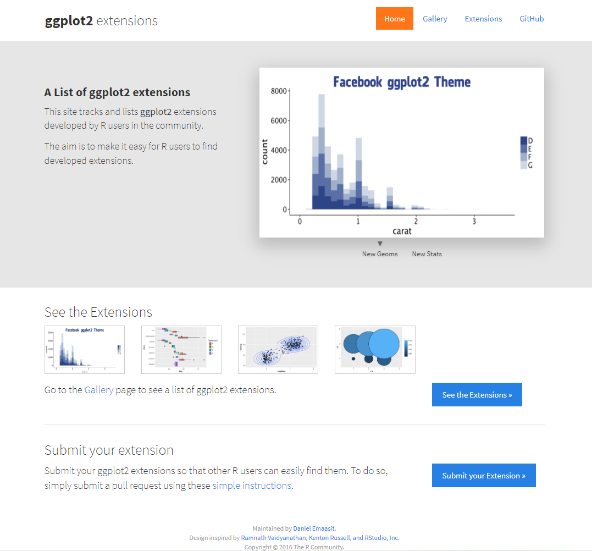
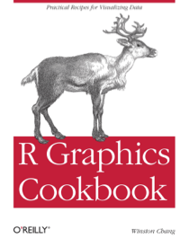

```{r setup, include=FALSE}
options(htmltools.dir.version = FALSE)
knitr::opts_chunk$set(
  fig.width=9, fig.height=3.5, fig.retina=3,
  out.width = "100%",
  cache = FALSE,
  echo = TRUE,
  message = FALSE, 
  warning = FALSE,
  hiline = TRUE
)

library(tidyverse)
```

```{r xaringan-themer, include=FALSE, warning=FALSE}
xaringanthemer::style_duo_accent(
  primary_color = "#005c8b",
  secondary_color = "#0073ae",
  inverse_header_color = "#FFFFFF"
)
```

```{r xaringanExtra, echo=FALSE}
#devtools::install_github("gadenbuie/xaringanExtra")
# xaringanExtra::use_xaringan_extra(c("tile_view", "animate_css", "tachyons"))

xaringanExtra::use_clipboard()

xaringanExtra::use_fit_screen()

xaringanExtra::use_extra_styles(
  hover_code_line = TRUE,         #<<
  mute_unhighlighted_code = TRUE  #<<
)

xaringanExtra::use_panelset()
```

```{r xaringanExtra-share-again, echo=FALSE}
xaringanExtra::use_share_again()
```

<!-- inicio font awesome -->
<script src="https://kit.fontawesome.com/1f72d6921a.js" crossorigin="anonymous"></script>
<!-- final font awesome -->

<!-- inicio github buttons  -->
<script async defer src="https://buttons.github.io/buttons.js"></script>
<!-- final github buttons  -->


.pull-left[
<br>
<br>
<br>
<br>
<br>
## Análises Econométricas

### Visualização de Dados

**[Luísa Gisele Böck](https://luisa.rbind.io/)**&nbsp;&nbsp;    <a href='mailto:luisa.bock@acad.ufsm.br'><i class="far fa-envelope"></i></a>    <a href='https://twitter.com/lgiselebock'><i class="fab fa-twitter"></i>   <a href='https://github.com/lgiselebock'><i class="fab fa-github"></i></a>

__.can-edit[Junho de 2023]__

]

.pull-right[
<br>
<br>
<br>
<br>
<br>
```{r echo=FALSE, out.width="400px"}
knitr::include_graphics("img/slides/34-intro-alisson-horst-04-ggplot.png")
```

.center[Ilustração por [Allison Horst](https://twitter.com/allison_horst/)]
]

---

.pull-left[
<br>
<br>
**Análise exploratória:**

- é um trabalho de **investigação** dos dados

- precisa ser **rápido** de programar

- o objetivo é **aprender**

```{r echo=FALSE, fig.align='center', fig.width=6, fig.height=4}
cars %>% 
  ggplot() +
  aes(x = speed, y = dist) +
  geom_point()
```

]

--

.pull-right[
<br>
<br>
**Análise descritiva:**

- é um trabalho de **otimização visual**

- precisa ser **customizável**

- o objetivo é **comunicar**

```{r echo=FALSE, fig.align='center', fig.width=6, fig.height=4}
cars %>% 
  ggplot() +
  aes(x = speed, y = dist) +
  geom_point(color = "darkblue") +
  geom_smooth(se = FALSE, color = "darkgrey", method="lm", formula = "y~x") +
  labs(
    title = "A velocidade influencia na distância de parada?",
    subtitle = "Distância necessária para parar o carro",
    caption = "Fonte: Ezekiel, M. (1930) Methods of Correlation Analysis. Wiley",
    x = "Velocidade",
    y = "Distância para parar"
  ) +
  theme_minimal()
```

]

<div class="my-header">Fonte: <a href="https://curso-r.github.io/202303-visualizacao/materiais/slides/slides.html">Curso-R</a></div>

---

class: inverse center middle

# Visualização de dados

.center[(Acompanhe no arquivo `04-visualizacao.R`)]

---

### Gramática de gráficos *em camadas*

O pacote `ggplot2` segue duas filosofias que ajudam a entender o processo de construção dos gráficos:

1. Um gráfico estatístico é uma representação visual dos dados por meio de atributos estéticos (posição, cor, forma, tamanho, ...) de formas geométricas (pontos, linhas, barras, ...). [The Grammar of Graphics](https://www.springer.com/gp/book/9780387245447).

2. Um gráfico pode ser construído em camadas (um gráfico é a sobreposição de elementos visuais). [A layered grammar of graphics](https://vita.had.co.nz/papers/layered-grammar.html).

----
<br>
Nos próximos exemplos, iremos utilizar a base dos `pinguins`. 

```{r}
library(tidyverse)

pinguins <- read_csv("dados/pinguins/pinguins.csv")
```

.footnote[Curiosidade: o gg em `ggplot` vem de *Grammar of Graphics*.]

<div class="my-header">Fonte: <a href="https://curso-r.github.io/202303-visualizacao/materiais/slides/slides.html">Curso-R</a></div>

---

### Camadas

Para construir um gráfico, começamos com o canvas. A função `ggplot()` recebe como argumento a base de dados e cria a primeira camada do gráfico: uma tela "em branco" (cinza).

```{r echo=FALSE, fig.align='center', dpi=300, out.width="70%"}
cars %>% 
  ggplot()
```

<div class="my-header">Fonte: <a href="https://curso-r.github.io/202303-visualizacao/materiais/slides/slides.html">Curso-R</a></div>

---

### Camadas

Depois, é possível trabalhar a estética e os detalhamentos do gráfico. 

<div class="panelset">
<div class="panel">
<div class="panel-name">Canvas</div>
```{r echo=TRUE, fig.align='center', dpi=300, out.width="70%"}
cars %>% 
  ggplot() #<<
```
</div>
<div class="panel">
<div class="panel-name">Eixos</div>
```{r echo=TRUE, fig.align='center', dpi=300, out.width="70%"}
cars %>% 
  ggplot() +
  aes(x = speed, y = dist) #<<
```
</div>
<div class="panel">
<div class="panel-name">Geometria</div>
```{r echo=TRUE, fig.align='center', dpi=300, out.width="70%"}
cars %>% 
  ggplot() +
  aes(x = speed, y = dist) +
  geom_point() #<<
```
</div>
</div>

<div class="my-header">Fonte: <a href="https://curso-r.github.io/202303-visualizacao/materiais/slides/slides.html">Curso-R</a></div>

---

### Camadas

<div class="panelset">
<div class="panel">
<div class="panel-name">Completo</div>
```{r echo=FALSE, fig.align='center', fig.width=9, fig.height=5, dpi=300}
cars %>% 
  ggplot() +
  aes(x = speed, y = dist) +
  geom_point(color = "darkblue") +
  geom_smooth(se = FALSE, color = "darkgrey", method="lm", formula = "y~x") +
  labs(
    title = "A velocidade influencia na distância de parada?",
    subtitle = "Distância necessária para parar o carro",
    caption = "Fonte: Ezekiel, M. (1930) Methods of Correlation Analysis. Wiley",
    x = "Velocidade",
    y = "Distância para parar"
  ) +
  theme_minimal()
```
</div>
<div class="panel">
<div class="panel-name">Completo (R)</div>
```{r eval=FALSE}
cars %>% 
  ggplot() +
  aes(x = speed, y = dist) +
  geom_point(color = "darkblue") +
  geom_smooth(
    se = FALSE, color = "darkgrey", 
    method="lm", formula = "y~x"
  ) +
  labs(
    title = "A velocidade influencia na distância de parada?",
    subtitle = "Distância necessária para parar o carro",
    x = "Velocidade", y = "Distância para parar",
    caption = paste(
      "Fonte: Ezekiel, M. (1930) Methods of",
      "Correlation Analysis. Wiley")
  )
  ) +
  theme_minimal()
```
</div>
</div>

<div class="my-header">Fonte: <a href="https://curso-r.github.io/202303-visualizacao/materiais/slides/slides.html">Curso-R</a></div>

---

# Curiosidade: por que o `+`?

Diferente dos outros pacotes do `tidyverse`, o `ggplot2` não usa o *pipe* (`%>%` ou `|>` depois do R 4.1). Isso acontece porque o `ggplot2` surgiu [antes que o autor tomasse conhecimento do pipe](https://www.reddit.com/r/dataisbeautiful/comments/3mp9r7/comment/cvi19ly/?utm_source=share&utm_medium=web2x&context=3).

<iframe id="reddit-embed" src="https://www.redditmedia.com/r/dataisbeautiful/comments/3mp9r7/im_hadley_wickham_chief_scientist_at_rstudio_and/cvi19ly/?depth=1&amp;showmore=false&amp;embed=true&amp;showmedia=false" sandbox="allow-scripts allow-same-origin allow-popups" style="border: none;" height="437" width="640" scrolling="no"></iframe>

<div class="my-header">Fonte: <a href="https://curso-r.github.io/202303-visualizacao/materiais/slides/slides.html">Curso-R</a></div>

---

# [Qual gráfico escolher?](https://www.data-to-viz.com)

```{r echo=FALSE, out.width="100%", fig.align='center'}
knitr::include_graphics("img/slides/35-data-to-viz.png")
```

<div class="my-header">Fonte: <a href="https://curso-r.github.io/202303-visualizacao/materiais/slides/slides.html">Curso-R</a></div>

---

### Um gráfico de pontos (dispersão)

```{r echo=TRUE, warning=TRUE}
pinguins %>% 
  ggplot() + 
  aes(x = comprimento_nadadeira, y = massa_corporal) + 
  geom_point() 
```

---

### Um gráfico de pontos (dispersão)

- Esse gráfico possui duas camadas: o canvas, gerado pela função `ggplot()`, e os pontos, gerados pela função `geom_point()`.

- As camada de um ggplot são unidas usando um `+`. Sim, precisamos controlar a nossa vontade de colocar um `%>%` em vez de `+` (essa é uma fonte de erro bem comum). A razão para precisarmos usar o `+` em vez do `%>%` é porque o pacote `ggplot` nasceu antes do `pipe`.

- A função `geom_point()` defique a forma geométrica (daí o prefixo `geom`) utilizada para representar os dados. Nesse caso, foram os pontos. Existe uma família de funções `geom`, sendo que cada uma vai representar uma forma geométrica diferente.

- O primeiro argumento de qualquer função `geom_*` é o `mapping`. Esse argumento serve para mapear os dados nos atributos estéticos da forma geométrica escolhida. Ele sempre receberá a função `aes()`. No exemplo acima, nós omitimos o nome do argumento, mas poderíamos ter escrito `geom_point(mapping = aes(x = x = comprimento_nadadeira, y = massa_corporal))`.

<div class="my-header">Fonte: <a href="https://curso-r.github.io/202303-visualizacao/materiais/slides/slides.html">Curso-R</a></div>

---

### Um gráfico de pontos (dispersão)

- A função `aes()` serve para *mapear os dados aos elemento estéticos do gráfico*. Os argumentos dela vão sempre depender da forma geométrica que estamos utilizando. No caso de um gráfico de pontos (dispersão), precisamos definir como as posições do eixo x e y serão construídas. No exemplo, a posição do ponto no eixo x será dada pela coluna `comprimento_nadadeira` e a posição do ponto no eixo y será dada pela coluna `massa_corporal`.

- O *warning* indica quandas observações (linhas) precisaram ser removidas por não possuir informação (`NA`).

- Veremos nos próximos exemplos que será bastante comum manipularmos a base (aplicando diversas funções do `dplyr`, por exemplo) antes de chamarmos a função `ggplot`.

.center[**O mapeamento das COLUNAS nas FORMAS GEOMÉTRICAS deve ser SEMPRE feito dentro da função `aes()`**]

<div class="my-header">Fonte: <a href="https://curso-r.github.io/202303-visualizacao/materiais/slides/slides.html">Curso-R</a></div>

---

### Um gráfico de pontos (dispersão)

Vamos inserir um novo elemento visual no gráfico: a reta de regressão linear.

```{r}
pinguins %>% 
  ggplot() +
  aes(x = comprimento_nadadeira, y = massa_corporal) +
  geom_point() +
  geom_smooth(method = "lm", formula = "y ~ x", se = FALSE) #<<
```


<div class="my-header">Fonte: <a href="https://curso-r.github.io/202303-visualizacao/materiais/slides/slides.html">Curso-R</a></div>

---

### Um gráfico de pontos (dispersão)

- A linha de tendência é acrescentada ao gráfico pela função `geom_smooth`. Esse `geom` é utilizado para demonstrar a linha que melhor se ajusta entre as variáveis analisadas. Nesse exemplo, foi incluída uma linha reta, em razão do modelo definido ser linear simples.

- Essa linha nos permite observar que há uma relação positivamente inclinada entre o comprimento da nadadeira e a massa comporal dos pinguins.

- Como não estamos mapeando colunas, não precisamos colocar os argumentos da função `geom_smooth()` do `aes()`.

- Em compensação, precisamos definir o método de cálculo e a fórmula utilizados, no caso, foi o modelo linear. O argumento `se = FALSE` retira o intervalo de confiança do erro-padrão.


<div class="my-header">Fonte: <a href="https://curso-r.github.io/202303-visualizacao/materiais/slides/slides.html">Curso-R</a></div>

---

### Um gráfico de pontos (dispersão)

Veja como o ggplot é realmente construído por camadas. Se colocarmos a camada da linha de tendência antes da camada dos pontos, estes ficam acima da linha.

```{r}
pinguins %>% 
  ggplot() +
  aes(x = comprimento_nadadeira, y = massa_corporal) +
  geom_smooth(method = "lm", formula = "y ~ x", se = FALSE) +
  geom_point()
  
```


<div class="my-header">Fonte: <a href="https://curso-r.github.io/202303-visualizacao/materiais/slides/slides.html">Curso-R</a></div>

---

### Um gráfico de pontos (dispersão)

Os atributos x e y são necessários para a construção de um gráfico de pontos. Outros atributos também podem ser mapeados em pontos, como a cor. Como a coluna especie é uma categoria, uma cor é atribuída para cada categoria. 

```{r}
pinguins %>% 
  ggplot() +
  aes(x = comprimento_nadadeira, y = massa_corporal) +
  geom_point(aes(color = especie)) #<<
```

<div class="my-header">Fonte: <a href="https://curso-r.github.io/202303-visualizacao/materiais/slides/slides.html">Curso-R</a></div>

---

### Um gráfico de pontos (dispersão)

Podemos adicionar mais um atributo estético no mesmo gráfico. Nesse caso, o formato dos pontos é definido pelos sexo dos pinguins.

```{r}
pinguins %>% 
  ggplot() +
  aes(x = comprimento_nadadeira, y = massa_corporal) +
  geom_point(aes(color = especie, shape = sexo)) #<<
```

<div class="my-header">Fonte: <a href="https://curso-r.github.io/202303-visualizacao/materiais/slides/slides.html">Curso-R</a></div>

---

### Gráfico de linhas

O `geom_line()` é utilizado para fazer gráficos de linhas. Esses gráficos são muito utilizados para representar séries temporais, isto é, observações medidas repetidamente em intervalos (em geral) equidistantes de tempo.

Assim como nos gráficos de pontos, é preciso definir as posições x e y para a construção dos gráficos de linhas.

A seguir, construímos um gráfico com a massa corporal média dos pinguins a cada ano, entre 2007 e 2009. Infelizmente, em razão do pequeno intervalo entre os anos, o gráfico apresenta poucas observações.

<div class="my-header">Fonte: <a href="https://curso-r.github.io/202303-visualizacao/materiais/slides/slides.html">Curso-R</a></div>

---

### Gráfico de linhas

```{r}
pinguins %>% 
  group_by(ano) %>% 
  summarise(
    massa_corporal_media = mean(massa_corporal, na.rm = TRUE)
  ) %>% 
  ggplot() +
  geom_line(aes(x = ano, y = massa_corporal_media)) #<<
```

<div class="my-header">Fonte: <a href="https://curso-r.github.io/202303-visualizacao/materiais/slides/slides.html">Curso-R</a></div>

---

### Gráfico de linhas

Podemos colocar pontos e retas no mesmo gráfico. Basta acrescentar os dois `geoms`.

.tiny[
```{r fig.width = 8, fig.height = 2.3}
pinguins %>% 
  group_by(ano) %>% 
  summarise(
    massa_corporal_media = mean(massa_corporal, na.rm = TRUE)
  ) %>% 
  ggplot() +
  geom_line(aes(x = ano, y = massa_corporal_media)) + #<<
  geom_point(aes(x = ano, y = massa_corporal_media)) #<<
```
]

<div class="my-header">Fonte: <a href="https://curso-r.github.io/202303-visualizacao/materiais/slides/slides.html">Curso-R</a></div>

---

### Gráfico de linhas

Quando precisamos usar o mesmo `aes()` em vários `geoms_*()`, pode-se defini-lo dentro da função `ggplot()`. Esse `aes()` será, então, distribuído para todos os `geoms` do gráfico. O código anterior pode ser reescrito da seguinte forma:

.tiny[
```{r fig.width = 8, fig.height = 2.3}
pinguins %>% 
  group_by(ano) %>% 
  summarise(
    massa_corporal_media = mean(massa_corporal, na.rm = TRUE)
  ) %>% 
  ggplot(aes(x = ano, y = massa_corporal_media)) + #<<
  geom_line() + #<<
  geom_point() #<<
```
]

<div class="my-header">Fonte: <a href="https://curso-r.github.io/202303-visualizacao/materiais/slides/slides.html">Curso-R</a></div>

---

### Gráfico de linhas

Se algum `geom` necessitar de um atributo que os outros não precisam, esse atributo pode ser especificado normalmente dentro dele na função `aes()`.

.tiny[
```{r fig.width = 8, fig.height = 2.3}
pinguins %>% 
  group_by(ano) %>% 
  summarise(
    massa_corporal_media = round(mean(massa_corporal, na.rm = TRUE), 2)
  ) %>% 
  ggplot(aes(x = ano, y = massa_corporal_media)) + #<<
  geom_line() + #<<
  geom_label(aes(label = massa_corporal_media)) #<<
```
]


<div class="my-header">Fonte: <a href="https://curso-r.github.io/202303-visualizacao/materiais/slides/slides.html">Curso-R</a></div>

---

### Gráfico de barras

Para construir gráficos de barras, é utilizado a função `geom_col()`. A seguir, construiremos um gráfico de barras do número de pinguins de cada espécie. 

```{r}
pinguins %>% 
  count(especie) %>% 
  ggplot() +
  geom_col(aes(x = especie, y = n)) #<<
```

<div class="my-header">Fonte: <a href="https://curso-r.github.io/202303-visualizacao/materiais/slides/slides.html">Curso-R</a></div>

---

### Gráfico de barras

- Os gráficos de barras também precisam dos atributos x e y, sendo que o atributo y representa a altura de cada barra.

- Quando o `NA` aparece no gráfico, é possível retirá-los usando, previamente, a função `filter()`.

- A seguir, atribuiremos a coluna `especie` à das colunas. Nesse caso, não será utilizado o atribulo `color`, mas `fill`. A regra é a seguinte: o atributo `color` colore objetos sem área (como pontos, linhas e contornos), e o atributo `fill` preenche os objetos com cor (barras, áreas e polígonos, em geral).

<div class="my-header">Fonte: <a href="https://curso-r.github.io/202303-visualizacao/materiais/slides/slides.html">Curso-R</a></div>

---

### Gráfico de barras

```{r}
pinguins %>% 
  count(especie) %>% 
  ggplot() +
  geom_col( #<<
    aes(x = especie, y = n, fill = especie), #<<
    show.legend = FALSE #<<
  ) #<<
```


<div class="my-header">Fonte: <a href="https://curso-r.github.io/202303-visualizacao/materiais/slides/slides.html">Curso-R</a></div>

---

### Gráfico de barras

Para arrumar as labels do eixo x, a melhor prática é inverter os eixos do gráfico, construindo barras horizontais.

.tiny[
```{r fig.width = 8, fig.height = 2.3}
pinguins %>% 
  count(especie) %>% 
  ggplot() +
  geom_col(
    aes(x = especie, y = n, fill= especie),
    show.legend = FALSE
  ) +
  coord_flip() #<<
```
]


<div class="my-header">Fonte: <a href="https://curso-r.github.io/202303-visualizacao/materiais/slides/slides.html">Curso-R</a></div>

---

### Gráfico de barras

- Para ordenar as colunas, é preciso mudar a ordem dos nívels do *fator* `especie`. Para isso, utiliza-se a função `fct_reorder()` do pacote `forcats`. A nova ordem será estabelecida pela coluna `n` (quantidade de espécies).

- Os fatores dentro do **R** são números inteiros (1, 2, 3, ...) que possuem uma representação textual. As variáveis categóricas são transformadas em fatores pelo `ggplot`, pois todo eixo cartesiano é numérico. Dessa forma, os textos de uma variável categórica são, internamente, números inteiros.

- Por padrão, os inteiros são atribuidos a cada categoria de uma variável pela ordem alfabética (repare na ordem dos nomes das espécies nos gráficos anteriores). Por exemplo, se transformássemos o vetor `c("banana", "uva", "melancia")` em um fator, a atribuição de inteiros seria: "banana" vira 1, "melancia" vira 2 e "uva" vira 3. Embora sejam inteiros internamente, sempre que chamássemos esse novo vetor, ainda veríamos os textos "banana", "uva" e "melancia".


<div class="my-header">Fonte: <a href="https://curso-r.github.io/202303-visualizacao/materiais/slides/slides.html">Curso-R</a></div>

---

### Gráfico de barras

```{r}
pinguins %>% 
  count(especie) %>% 
  mutate(especie = forcats::fct_reorder(especie, n)) %>%  #<<
  ggplot() +
  geom_col(
    aes(x = especie, y = n, fill= especie),
    show.legend = FALSE
  ) +
  coord_flip()
```


<div class="my-header">Fonte: <a href="https://curso-r.github.io/202303-visualizacao/materiais/slides/slides.html">Curso-R</a></div>

---

### Gráfico de barras

Por fim, é possível colocar uma label de cada barra, contendo o número de pinguins de cada espécie.

.tiny[
```{r fig.width = 8, fig.height = 2.3}
pinguins %>% 
  count(especie) %>% 
  mutate(especie = forcats::fct_reorder(especie, n)) %>%  
  ggplot() +
  aes(x = especie) + #<< # atributo espécie é comum a todos geoms
  geom_col(aes(y = n, fill= especie), show.legend = FALSE) +
  geom_label(aes(y = n/2, label = n)) + #<<
  coord_flip()
```
]

<div class="my-header">Fonte: <a href="https://curso-r.github.io/202303-visualizacao/materiais/slides/slides.html">Curso-R</a></div>

---

### Histograma

Bastante usado na estatística, os histogramas são construídos a partir da função `geom_histogram()`. 

Esse `geom` precisa apenas do atributo x (o eixo y é construído automaticamente). Histogramas são úteis para avaliar a distribuição de uma variável. 

<br>

A seguir construiremos o histograma da massa corporal dos Pinguins-de-Adélia.

  - o primeiro `warning` diz que o eixo x foi dividido em 30 intervalos para a construção do histograma.
  
  - o segundo `warning` diz que 1 linhas foi removida por conter valores ausentes (`NA`).


<div class="my-header">Fonte: <a href="https://curso-r.github.io/202303-visualizacao/materiais/slides/slides.html">Curso-R</a></div>

---

### Histograma

```{r warning=TRUE, message=TRUE}
pinguins %>% 
  filter(especie == "Pinguim-de-adélia") %>% 
  ggplot() +
  geom_histogram(aes(x = massa_corporal))
```


<div class="my-header">Fonte: <a href="https://curso-r.github.io/202303-visualizacao/materiais/slides/slides.html">Curso-R</a></div>

---

### Histograma

Para definir o tamanho de cada intervalo, utiliza-se o argumento `bindwidth`.

.tiny[
```{r fig.width=7, fig.height=2.5}
pinguins %>% 
  filter(especie == "Pinguim-de-adélia") %>% 
  ggplot() +
  geom_histogram(aes(x = massa_corporal), 
                 # define o tamanho de cada intervalo
                 binwidth = 100, #<< 
                 # altera a cor das fordas de cada coluna
                 color = "white") #<< 
```
]


<div class="my-header">Fonte: <a href="https://curso-r.github.io/202303-visualizacao/materiais/slides/slides.html">Curso-R</a></div>

---

### Boxplot

Boxplots também são bastante utilizados na estatística, no estudo da distribuição de uma variável. Especialmente quando se quer comparar várias distribuições.

Para construir um boxplot no `ggplot`, é utilizado a função `geom_boxplot()`. Ela precisa dos atributos x e y, sendo que ao atributo x é mapeado uma variável categórica.

A seguir, será construído um boxplot com as espécies no eixo x e a distribuição do comprimento da nadadeira no eixo y.

<div class="my-header">Fonte: <a href="https://curso-r.github.io/202303-visualizacao/materiais/slides/slides.html">Curso-R</a></div>

---

### Boxplot

.tiny[
```{r fig.width=7, fig.height=3, warning=TRUE}
pinguins %>% 
  ggplot() +
  aes(x = especie, y = comprimento_nadadeira) + #<<
  geom_boxplot(aes(color = especie), show.legend = FALSE) #<<
```
]


<div class="my-header">Fonte: <a href="https://curso-r.github.io/202303-visualizacao/materiais/slides/slides.html">Curso-R</a></div>

---

### Títulos, labels e escalas

Para colocar títulos no gráfico ou alterar as *labels* dos atributos, utilizamos a função `labs()`. Os principais argumentos dessa função são:  

  - `title =` texto do título
  - `subtitle =` texto do subtítulo
  - `caption =` texto da legenda
  - `x =` texto do título do atributo x
  - `y =` texto do título do atributo y

Para alterar as escalas (textos e quebras), usamos as funções da famílias `scale_`.

Para definir qual porção do gráfico deve ser mostrada, usa-se a função `coord_cartesian()`.

<div class="my-header">Fonte: <a href="https://curso-r.github.io/202303-visualizacao/materiais/slides/slides.html">Curso-R</a></div>

---

### Títulos, labels e escalas

```{r}
pinguins %>% 
  ggplot() +
  aes(x = comprimento_nadadeira, y = massa_corporal) +
  geom_point(aes(color = especie)) +
  labs(x = "Comprimento da nadadeira (mm)", y = "Massa corporal (mm)", #<<
    color = "Espécies", title = "Gráfico de dispersão", #<<
    subtitle = "Comprimento da nadadeira vs Massa corporal", #<<
    caption = "{palmerpenguins}") #<<
```


<div class="my-header">Fonte: <a href="https://curso-r.github.io/202303-visualizacao/materiais/slides/slides.html">Curso-R</a></div>

---

### Títulos, labels e escalas

Mudando as quebras dos eixos x e y:

.tiny[
```{r fig.width=7, fig.height=2}
pinguins %>% 
  group_by(ano) %>% 
  summarise(
    massa_corporal_media = mean(massa_corporal, na.rm = TRUE)
  ) %>% 
  ggplot() +
  geom_line(aes(x = ano, y = massa_corporal_media)) +
  scale_x_continuous(breaks = seq(2007, 2009, 1)) + #<<
  scale_y_continuous(breaks = seq(4000, 4250, 25)) #<<
```
]


<div class="my-header">Fonte: <a href="https://curso-r.github.io/202303-visualizacao/materiais/slides/slides.html">Curso-R</a></div>

---

### Cores

Também existe funções `scale` para os atributos de cor: `scale_color_*` e `scale_fill_*`.

Para escolher manualmente as cores de um gráfico, utiliza-se as funções `scale_color_manual()` e `scale_fill_manual()`.

Para trocar o nome nas legendas geradas pelos atributos de cor, utiliza-se as funções `scale_color_discrete()` e `scale_fill_discrete()`.

<div class="my-header">Fonte: <a href="https://curso-r.github.io/202303-visualizacao/materiais/slides/slides.html">Curso-R</a></div>

---

### Cores

Substituindo as cores padrão do gráfico por um outro conjunto de cores.

```{r fig.width=7, fig.height=2}
pinguins %>% 
  count(especie) %>% 
  mutate(especie = forcats::fct_reorder(especie, n)) %>%
  ggplot() +
  aes(x = especie, y = n) +
  geom_col(aes(fill= especie), show.legend = FALSE)+
  coord_flip() +
  scale_fill_manual(values = c("red", "blue", "purple")) #<<
```


<div class="my-header">Fonte: <a href="https://curso-r.github.io/202303-visualizacao/materiais/slides/slides.html">Curso-R</a></div>

---

### Cores

Também podemos usar códigos hexadecimais. 

```{r fig.width=7, fig.height=2}
pinguins %>% 
  count(especie) %>% 
  mutate(especie = forcats::fct_reorder(especie, n)) %>%
  ggplot() +
  aes(x = especie, y = n) +
  geom_col(aes(fill= especie), show.legend = FALSE)+
  coord_flip() +
  scale_fill_manual(values = c("#ff0000", "#0000ff", "#a020f0")) #<<
```


<div class="my-header">Fonte: <a href="https://curso-r.github.io/202303-visualizacao/materiais/slides/slides.html">Curso-R</a></div>

---

### Cores

.tiny[
```{r}
pinguins %>% 
  ggplot(aes(x = comprimento_nadadeira)) +
  geom_histogram(aes(fill = especie),
                 alpha = 0.5, position = "identity") + #<<
  scale_fill_manual(values = c("darkorange","purple","cyan4")) + #<<
  labs(x = "Comprimento da nadadeira (mm)", y = "Frequência",
       title = "Comprimento da nadadeira dos Pinguins") +
  theme_minimal() 
```
]


<div class="my-header">Fonte: <a href="https://curso-r.github.io/202303-visualizacao/materiais/slides/slides.html">Curso-R</a></div>

---

### Cores

.tiny[
```{r fig.width=7, fig.height=2.5}
pinguins %>% 
  ggplot() +
  aes(x = especie, y = comprimento_nadadeira, color = especie) +
  geom_boxplot(width = 0.3, show.legend = FALSE) + #<<
  geom_jitter(alpha = 0.5, show.legend = FALSE, #<<
              position = position_jitter(width = 0.2, seed = 0)) + #<<
  scale_color_manual(values = c("darkorange","purple","cyan4")) +
  labs(x = "Espécies", y = "Comprimento da nadadeira (mm)") +
  theme_minimal()
```
]

<div class="my-header">Fonte: <a href="https://curso-r.github.io/202303-visualizacao/materiais/slides/slides.html">Curso-R</a></div>

---

### Cores

**Paletas de cores prontas:**

- <b>Escalas qualitativas:</b> utilizado para variáveis nominais (sexo, cor/raça)

- <b>Escalas divergenstes:</b> utilizado para variáveis que têm um centro neutro (favorável/neutro/desfavorável, correlação)

- <b>Escalas sequenciais:</b> utilizado para variáveis ordinais (faixa etária, renda)

- <b>Viridis</b> muito últil para comunicar com pessoas com daltonismo


<div class="my-header">Fonte: <a href="https://curso-r.github.io/202303-visualizacao/materiais/slides/slides.html">Curso-R</a></div>

---

### Cores

**Paletas de cores no `ggplot2`:**

- `scale_*_brewer()`: utilizada para variáveis discretas. Possui três tipos: divergente, qualitativa e sequencial.
- `scale_*_distiller()`: utilizada para variáveis contínuas. Interpola as cores do brewer para lidar com todos os valores.
- `scale_*_fermenter()`: utilizada para variáveis contínuas, que são transformadas em discretas (binned).
- `scale_*_viridis_[cdb]`: Escala viridis para variáveis contínuas, discretas ou binned.
- `scale_*_manual()`: inclui um conjunto de cores manualmente.


**Paletas de outros pacotes:**

- `{ggthemr}` tem um monte de paletas, mas está um pouco desatualizado.
- `{hrbrthemes}` contém uma lista de temas escolhidos pelo Bob Rudis.
- `{ghibli}` tem paletas de cores relacionadas ao Studio Ghibli.
- `{paletteer}` tem uma coleção de cores de vários outros pacotes de paletas.
- `{RColorBrewer}` tem uma coleção de paletas (sequenciais, qualitativas e divergentes) para gráficos e mapas.


<div class="my-header">Fonte: <a href="https://curso-r.github.io/202303-visualizacao/materiais/slides/slides.html">Curso-R</a></div>

---

### Trocando os textos da legenda

```{r}
pinguins %>% 
  ggplot() +
  aes(x = comprimento_nadadeira, y = massa_corporal) +
  geom_point(aes(color = especie)) +
  scale_color_discrete( #<<
    labels = c( #<<
      "Pinguim de Adelia", "Pinguim de Barbicha", "Pinguim Gentoo" #<<
    ) #<<
  ) #<<
```


<div class="my-header">Fonte: <a href="https://curso-r.github.io/202303-visualizacao/materiais/slides/slides.html">Curso-R</a></div>

---

### Temas

Os gráficos usados até o momento usam o tema padrão do `ggplot2` (com o fundo cinza). Existem outros temas prontos na família de funções `theme_*()` para a utilização.

Também é possível criar temas próprios usando a função `theme()`. Nesse caso, para trocar os elementos estéticos do gráfico, é preciso usar as funções `element_text()` para os texto, `element_line()` para as linhas, `element_rect()` para as áreas e, finalmente, `element_blank()` para remover os elementos.


<div class="my-header">Fonte: <a href="https://curso-r.github.io/202303-visualizacao/materiais/slides/slides.html">Curso-R</a></div>

---

### Temas

<div class="panelset">
<div class="panel">
<div class="panel-name">padrão</div>
```{r echo=TRUE, fig.align='center', dpi=300, out.width="100%"}
pinguins %>% 
  ggplot() + 
  aes(x = comprimento_nadadeira, y = massa_corporal) + 
  geom_point()
```
</div>
<div class="panel">
<div class="panel-name">bw</div>
```{r echo=TRUE, fig.align='center', dpi=300, out.width="100%"}
pinguins %>% 
  ggplot() + 
  aes(x = comprimento_nadadeira, y = massa_corporal) + 
  geom_point() +
  theme_bw() #<<
```
</div>
<div class="panel">
<div class="panel-name">classic</div>
```{r echo=TRUE, fig.align='center', dpi=300, out.width="100%"}
pinguins %>% 
  ggplot() + 
  aes(x = comprimento_nadadeira, y = massa_corporal) + 
  geom_point() +
  theme_classic() #<<
```
</div>
<div class="panel">
<div class="panel-name">light</div>
```{r echo=TRUE, fig.align='center', dpi=300, out.width="100%"}
pinguins %>% 
  ggplot() + 
  aes(x = comprimento_nadadeira, y = massa_corporal) + 
  geom_point() +
  theme_light() #<<
```
</div>
<div class="panel">
<div class="panel-name">minimal</div>
```{r echo=TRUE, fig.align='center', dpi=300, out.width="100%"}
pinguins %>% 
  ggplot() + 
  aes(x = comprimento_nadadeira, y = massa_corporal) + 
  geom_point() +
  theme_minimal() #<<
```
</div>
<div class="panel">
<div class="panel-name">void</div>
```{r echo=TRUE, fig.align='center', dpi=300, out.width="100%"}
pinguins %>% 
  ggplot() + 
  aes(x = comprimento_nadadeira, y = massa_corporal) + 
  geom_point() +
  theme_void() #<<
```
</div>
<div class="panel">
<div class="panel-name">dark</div>
```{r echo=TRUE, fig.align='center', dpi=300, out.width="100%"}
pinguins %>% 
  ggplot() + 
  aes(x = comprimento_nadadeira, y = massa_corporal) + 
  geom_point() +
  theme_dark() #<<
```
</div>
</div>


<div class="my-header">Fonte: <a href="https://curso-r.github.io/202303-visualizacao/materiais/slides/slides.html">Curso-R</a></div>

---

### Criando um próprio tema

```{r fig.width=7, fig.height=2}
pinguins %>% 
  ggplot() +
  aes(x = comprimento_nadadeira, y = massa_corporal) +
  geom_point(aes(color = especie)) +
  labs(title = "Gráfico de dispersão", 
       subtitle = "Comprimento da nadadeira vs Massa corporal") +
  theme(plot.title = element_text(hjust = 0.5), #<<
    plot.subtitle = element_text(hjust = 0.5), #<<
    axis.title = element_text(color = "red"), #<<
    panel.background = element_rect(fill = "lightgrey"), #<<
    panel.grid = element_blank()) #<<
```

<div class="my-header">Fonte: <a href="https://curso-r.github.io/202303-visualizacao/materiais/slides/slides.html">Curso-R</a></div>

---

## Para saber mais! 

.pull-left[

- [Extensões do ggplot2](https://exts.ggplot2.tidyverse.org/gallery/)

<a href="http://material.curso-r.com/">
```{r echo=FALSE, out.width="100%", fig.align='center'}

```
</a>
]

.pull-right[
- [Livro R Cookbook (seção de gráficos)](http://www.cookbook-r.com/Graphs/)

<a href="https://r4ds.had.co.nz/">
```{r fig.align='center', echo=FALSE, out.width="60%"}

```
</a>
]

---

# Obrigada!

.pull-left[

```{r echo=FALSE, out.width="65%", fig.align='center'}
knitr::include_graphics("https://media.giphy.com/media/v1.Y2lkPTc5MGI3NjExNjFlNDgyOTRhMTk5MGE4ZTNmNjg5ZWMzM2NlZDU3ODBmZDU0OGFiNiZlcD12MV9pbnRlcm5hbF9naWZzX2dpZklkJmN0PWc/M9NbzZjAcxq9jS9LZJ/giphy.gif")
```

.center[Agradecimento especial a [Curso-R](https://curso-r.com/) pelos materiais.]

.center[Slides criados usando os pacotes em R:]
.center[[**xaringan**](https://github.com/yihui/xaringan)]
.center[[**xaringanthemer**](https://github.com/gadenbuie/xaringanthemer)]

.center[O chakra vem da biblioteca JavaScript [remark.js](https://remarkjs.com), [**knitr**](http://yihui.name/knitr), and [R Markdown](https://rmarkdown.rstudio.com).]
]

.pull-right[

```{r echo=FALSE, out.width="55%", fig.align='center'}

```

.center[<i class="fas fa-home"></i> [luisa.rbind.io](https://luisa.rbind.io/)]

.center[<i class="fab fa-twitter"></i> [@lgiselebock](https://twitter.com/lgiselebock)]

.center[<i class="fab fa-github"></i> [@lgiselebock](https://github.com/lgiselebock/)]

.center[<i class="far fa-envelope"></i> [luisa.bock@acad.ufsm.br](mailto:luisa.bock@acad.ufsm.br)]
]

<!-- inicio academic icons -->
<link rel="stylesheet" href="https://cdn.jsdelivr.net/gh/jpswalsh/academicons@1/css/academicons.min.css">
<!-- final academic icons -->

 
<!-- inicio font awesome -->
<script src="https://kit.fontawesome.com/1f72d6921a.js" crossorigin="anonymous"></script>

<!-- final font awesome -->
