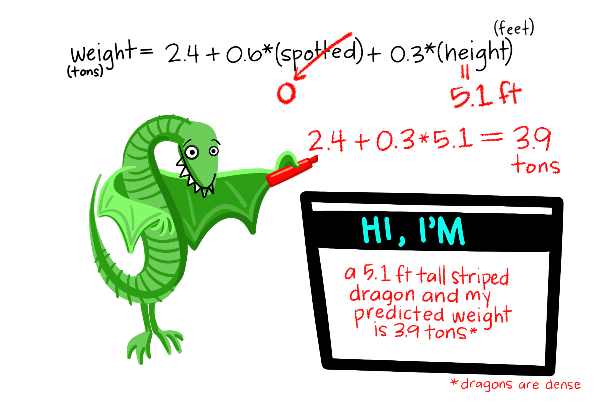

```{r setup, include=FALSE}
options(htmltools.dir.version = FALSE)
knitr::opts_chunk$set(
  fig.width=9, fig.height=3.5, fig.retina=3,
  out.width = "100%",
  cache = FALSE,
  echo = TRUE,
  message = FALSE, 
  warning = FALSE,
  hiline = TRUE,
  erros = FALSE
)

library(tidyverse)
options(scipen = 99999)
```

```{r xaringan-themer, include=FALSE, warning=FALSE}
xaringanthemer::style_duo_accent(
  primary_color = "#005c8b",
  secondary_color = "#0073ae",
  inverse_header_color = "#FFFFFF"
)
```

```{r xaringanExtra, echo=FALSE}
#devtools::install_github("gadenbuie/xaringanExtra")
# xaringanExtra::use_xaringan_extra(c("tile_view", "animate_css", "tachyons"))

xaringanExtra::use_clipboard()

xaringanExtra::use_fit_screen()

xaringanExtra::use_extra_styles(
  hover_code_line = TRUE,         #<<
  mute_unhighlighted_code = TRUE  #<<
)

xaringanExtra::use_panelset()
```

```{r xaringanExtra-share-again, echo=FALSE}
xaringanExtra::use_share_again()
```

<!-- inicio font awesome -->
<script src="https://kit.fontawesome.com/1f72d6921a.js" crossorigin="anonymous"></script>
<!-- final font awesome -->

<!-- inicio github buttons  -->
<script async defer src="https://buttons.github.io/buttons.js"></script>
<!-- final github buttons  -->


.pull-left[
<br>
<br>
<br>
<br>
<br>
## Análises Econométricas

### Regressões Lineares

**[Luísa Gisele Böck](https://luisa.rbind.io/)**&nbsp;&nbsp;    <a href='mailto:luisa.bock@acad.ufsm.br'><i class="far fa-envelope"></i></a>    <a href='https://twitter.com/lgiselebock'><i class="fab fa-twitter"></i>   <a href='https://github.com/lgiselebock'><i class="fab fa-github"></i></a>

__.can-edit[Junho de 2023]__

]

.pull-right[
<br>
<br>
<br>
<br>
<br>
```{r echo=FALSE, out.width="700px"}

```

.center[Ilustração por [Allison Horst](https://twitter.com/allison_horst/)]
]

---

class: inverse center middle

# Dados Educacionais

<!-- .center[(Acompanhe no arquivo `04-visualizacao.R`)] -->

---

### Importando as bases

.tiny[
```{r}
library(tidyverse) # pacote necessário

ideb_fundamental <- 
  read_csv("dados/educacionais/ideb_fundamental.csv", 
  col_types = cols(id_municipio = col_character(), ano = col_integer()))

ideb_medio <- 
  read_csv("dados/educacionais/ideb_medio.csv", 
  col_types = cols(id_municipio = col_character(), ano = col_integer()))

indicadores_fundamental <- 
  read_csv("dados/educacionais/indicadores_fundamental.csv",
  col_types = cols(id_municipio = col_character(), ano = col_integer()))

indicadores_medio <- 
  read_csv("dados/educacionais/indicadores_medio.csv",
  col_types = cols(id_municipio = col_character(), ano = col_integer()))

pib_pc <- 
  read_csv("dados/educacionais/pib_pc.csv",
  col_types = cols(id_municipio = col_character(), ano = col_integer()))

```
]

---

<div class="panelset">
<div class="panel">
<div class="panel-name">Ideb</div>
.tiny[
```{r}
head(ideb_fundamental, n = 5)

head(ideb_medio, n = 5)
```
]
</div>
<div class="panel">
<div class="panel-name">Dicionário</div>

**BASES IDEB_FUNDAMENTAL E IDEB_MÉDIO**

- **Fundamental:** Ensino Fundamental

- **Médio:** Ensino Médio

1. `id_municipio`: código do IBGE de identificação do município

2. `tx_aprov`: taxa de aprovação média do município 

3. `ideb`: índice de desenvolvimento da educação básica

  - é calculado a partir dos dados de aprovação escolar (obtidos pelo Censo Escolar) e das médias de desempenho no Sistema de Avaliação da Educação Básica (Saeb)

</div>
<div class="panel">
<div class="panel-name">Indicadores</div>
.tiny[
```{r}
head(indicadores_fundamental, n = 5)

head(indicadores_medio, n = 5)
```
]
</div>
<div class="panel">
<div class="panel-name">Dicionário</div>

**BASES INDICADORES_FUNDAMENTAL E INDICADORES_MÉDIO**

- **Fundamental:** Ensino Fundamental

- **Médio:** Ensino Médio

1. `id_municipio`: código do IBGE de identificação do município

2. `tx_aband`: taxa de abandono escolar média do município 

3. `hrs_aula`: média das horas de aula por município

4. `tdi`: taxa de distorção idade-série

  - proproção de alunos com mais de 2 anos de atraso escolar

</div>
<div class="panel">
<div class="panel-name">PIB</div>
.tiny[
```{r}
head(pib_pc, n = 5)
```
]
</div>
<div class="panel">
<div class="panel-name">Dicionário</div>

**PIB**

1. `id_municipio`: código do IBGE de identificação do município

2. `pib`: pib dos municípios em 2020

3. `populacao`: população dos municípios em 2020

</div>
</div>

<div class="my-footer">O Pib <i>per capita</i> será calculado depois.</div>

<div class="my-header">Fonte: <a href="https://curso-r.github.io/202303-visualizacao/materiais/slides/slides.html">ALTERAR A FONTE</a></div>

---

### Padronizando as bases de dados

<div class="panelset">
<div class="panel">
<div class="panel-name">Ideb (F)</div>
.tiny[
```{r}
ideb_fundamental <- ideb_fundamental %>% 
  select(id_municipio, tx_aprov, ideb)

ideb_fundamental
```
]
</div>
<div class="panel">
<div class="panel-name">Ideb (M)</div>

```{r}
ideb_medio <- ideb_medio %>% 
  select(id_municipio, tx_aprov, ideb)

ideb_medio
```

</div>
<div class="panel">
<div class="panel-name">Indicador (F)</div>

```{r}
indicadores_fundamental <- indicadores_fundamental %>% 
  select(id_municipio, tx_aband, hrs_aula, tdi)

indicadores_fundamental
```

</div>
<div class="panel">
<div class="panel-name">Indicador (M)</div>

```{r}
indicadores_medio <- indicadores_medio %>% 
  select(id_municipio, tx_aband, hrs_aula, tdi)

indicadores_medio
```

</div>
<div class="panel">
<div class="panel-name">PIB</div>
.tiny[
```{r}
pib_pc <- pib_pc %>% 
  mutate(pib_pc = round(pib/populacao, 2)) %>%  # cria a coluna pib_pc
  select(id_municipio, pib_pc)  
  
pib_pc
```
]
</div>
</div>

---

### Juntando as bases de dados: Fundamental

<div class="panelset">
<div class="panel">
<div class="panel-name">left-join seguidos</div>

```{r}
left_join(
  ideb_fundamental, indicadores_fundamental, by = "id_municipio"
) %>% 
  left_join(pib_pc, by = "id_municipio")
```

</div>
<div class="panel">
<div class="panel-name">reduce</div>

```{r}
# PROGRAMAÇÃO FUNCIONAL - MAIS INDICADO! 
fund <- list(ideb_fundamental, indicadores_fundamental, pib_pc) %>% 
  reduce(left_join)

fund
```
</div>
</div>

---

### Análises Descritivas: Fundamental

<div class="panelset">
<div class="panel">
<div class="panel-name">resumo</div>

```{r}
summary(fund)
```

</div>
<div class="panel">
<div class="panel-name">histogram</div>

```{r}
fund %>% 
  ggplot() +
  aes(x = ideb) +
  geom_histogram()
```
</div>
<div class="panel">
<div class="panel-name">bloxplot</div>

```{r}
fund %>% 
  ggplot() +
  aes(x = ideb) +
  geom_boxplot()
```
</div>
</div>

---

### Regressão Linear: Fundamental

**Será que a `tdi` e a `tx_aband` possuem relação positiva?**

.tiny[
```{r}
fund %>% 
  ggplot(aes(x = tdi, y = tx_aband)) +
  geom_point()
```
]
---

**Será que a `tdi` e a `tx_aband` possuem relação positiva?**

.tiny[
```{r}
modelo_1 <- lm(tx_aband ~ tdi, data = fund)
summary(modelo_1)
```
]

---

**Será que a `tdi` e a `tx_aband` possuem relação positiva?**

A relação entre `tdi` e `tx_aband` é positiva, mas não parece ser muito forte.

<br>
$$
\text{tx_aband} = -0.568 + 0.124\text{tdi}   
$$
<br>

**Interpretação:** O aumento de 1 p.p. na taxa de distorção idade-série (`tdi`) retorna um aumento de 0.12 p.p. na taxa de abandono escolar (`tx_aband`).

Quanto maior a distorção idade-série (`dti`), maiores são as taxas de abandono escolar (`tx_aband`).

---

**Qual a relação entre `tdi`, `tx_aprov`, `hrs_aula` e a `tx_aband`?**

.tiny[
```{r}
modelo_2 <- lm(tx_aband ~ tdi + tx_aprov + hrs_aula, data = fund)
summary(modelo_2)
```
]

---

**Qual a relação entre `tdi`, `tx_aprov`, `hrs_aula` e a `tx_aband`?**

A taxa de distorção idade-série (`dti`) e as horas-aula (`hrs_aula`) possuem relação positiva em relação à taxa de abandono (`tx_aband`), sendo a primeira variável com significância estatística muito próxima de zero, ou seja, significativa estatisticamente, e a segunda variável significativa estatisticamente para 90%. A taxa de aprovação (`tx_aprov`) apresenta uma relação negativa com a taxa de abandono (`tx_aband`), sendo aquela estatisticamente significativa.


$$
\text{tx_aband} = 22.093 + 0.059 \text{tdi} - 0.228 \text{tx_aprov} + 0.04 \text{hrs_aula}
$$
**Interpretação:**

Um aumento de 1 p.p. na taxa de distorção idade-série (`tdi`) gera um aumento de 0.059 p.p. na taxa de abandono escolar (`tx_aband`), *ceteris paribus*. 

Um aumento de 1 p.p. na taxa de aprovação (`tx_aprov`) resulta em uma redução de 0.228 p.p. na taxa de abandono (`tx_aband`), *ceteris paribus*. 

Um aumento de 1 hora-aula (`hrs_aula`) resulta em um aumento de 0.04 p.p. na taxa de abandono escolar (`tx_aband`). 

---

**Qual a relação entre `tdi`, `tx_aprov`, `pib_pc` e a `tx_aband`?**

.tiny[
```{r}
modelo_3 <- lm(tx_aband ~ tdi + tx_aprov + pib_pc, data = fund)
summary(modelo_3)
```
]
---
<br>
<br>

$$
\text{tx_aband} = 22.438 + 0.056 \text{tdi} - 0.229 \text{tx_aprov} + 0.000004 \text{pib_pc}
$$
**Interpretação:**

O pib *per capita* (`pib_pc`) possui uma relação negativa com a taxa de abandono escolar (`tx_aband`), isto é, quanto maior for o pib *per capita* do município, menor será a taxa de abandono escolar.

O aumento de 1 Real no pib *per capita* gera uma queda de 0.000004 p.p. na taxa de abandono escolar. Convertendo o valor do `pib_pc` para 10 mil Reais, isso corresponde a um decréscimo de 0.04 p.p. na taxa de abandono escolar.

Isso indica que municípios mais ricos possuem valores consideravelmente menores de abandono escolar quando comparados com municípios mais pobres, *ceteris paribus*.

---

### Juntando as bases de dados: Médio

<div class="panelset">
<div class="panel">
<div class="panel-name">left-join seguidos</div>

```{r}
left_join(
  ideb_medio, indicadores_medio, by = "id_municipio"
) %>% 
  left_join(pib_pc, by = "id_municipio")
```

</div>
<div class="panel">
<div class="panel-name">reduce</div>

```{r}
# PROGRAMAÇÃO FUNCIONAL - MAIS INDICADO! 
medio <- list(ideb_medio, indicadores_medio, pib_pc) %>% 
  reduce(left_join)

medio
```
</div>
</div>

---

### Análises Descritivas: Médio

<div class="panelset">
<div class="panel">
<div class="panel-name">resumo</div>

```{r}
summary(medio)
```

</div>
<div class="panel">
<div class="panel-name">histogram</div>

```{r}
medio %>% 
  ggplot() +
  aes(x = ideb) +
  geom_histogram()
```
</div>
<div class="panel">
<div class="panel-name">bloxplot</div>

```{r}
# PROGRAMAÇÃO FUNCIONAL - MAIS INDICADO! 
medio %>% 
  ggplot() +
  aes(x = ideb) +
  geom_boxplot()
```
</div>
</div>


---

### Regressão Linear: Médio

**Qual a relação entre o `ideb` e a `tx_aband`?**

```{r}
medio %>% 
  ggplot(aes(x = ideb, y = tx_aband)) +
  geom_point() # +
  # geom_smooth(method = "lm", se = FALSE)
```


Quanto maior o ideb, menor é a taxa de abandono. Relaçào forte com a queda na taxa de abandono.

---

**Qual a relação entre a `tx_aprov` e a `tx_aband`?**


```{r}
medio %>% 
  ggplot(aes(x = tx_aprov, y = tx_aband)) +
  geom_point() # +
  # geom_smooth(method = "lm", se = FALSE)
```


---

**Qual a relação entre a `hrs_aula` e a `tx_aband`?**


```{r}
medio %>% 
  ggplot(aes(x = hrs_aula, y = tx_aband)) +
  geom_point() # +
  # geom_smooth(method = "lm", se = FALSE)
```


---

```{r}
modelo_4 <- lm(tx_aband ~ tx_aprov + tdi + hrs_aula + pib_pc, data = medio)
summary(modelo_4)
```

---

<br>

$$
\text{tx_aband} = 49.94 - 0.504 \text{tx_aprov} + 0.093 \text{tdi} - 0.136 \text{hrs_aula} - 0.00001\text{pibpc}
$$
**Interpretação:**

O aumento de 1 p.p. na taxa de aprovação (`tx_aprov`) reduz em 0.50 p.p. a taxa de abandono escolar (`tx_aband`), *ceteris paribus*. 

O aumento de 1 p.p. na taxa de distorção idade-série (`tdi`) aumenta em 0.082 p.p. a taxa de abandono escolar (`tx_aband`), *ceteris paribus*.

O aumento de 1 hora-aula (`hrs_aula`) diminui em 0.136 p.p. a taxa de abandono escolar (`tx_aband`), *ceteris paribus*.

O aumento de 1 Real no pib *per capita* gera uma queda de 0.00001 p.p. na taxa de abandono escolar, *ceteris paribus*. Convertendo o valor do `pib_pc` para 10 mil Reais, isso corresponde a uma redução de 0.1 p.p. na taxa de abandono escolar, *ceteris paribus*.

Quanto mais tempo o adolescente passa na escola, menor é a queda na taxa de abandono escolar. As taxas de abandono no ensino médio são maiores quando comparado com o ensino fundamental. O pib *per capita* afeta mais os dados do ensino médio do que do ensino fundamental.

---

class: inverse center middle

# Base dos Dados

<!-- .center[(Acompanhe no arquivo `04-visualizacao.R`)] -->

---


```{r}
# install.packages("basedosdados")

library(basedosdados)

# faz a ligação entre o R e a BigQuery do Google
set_billing_id("luisagisele") 
```


```{sql eval = FALSE, include = TRUE}
# sem filtro
"SELECT coluna1, coluna2, coluna3,
coluna4 AS apelido_da_coluna
FROM `tabela`" 

# com filtro
"SELECT coluna1, coluna2, coluna3,
coluna4 AS apelido_da_coluna
FROM `tabela`
WHERE coluna1 = valor AND coluna2 = valor"
```


---

class: inverse center middle

# Atlas do Desenvolvimento Humano

<!-- .center[(Acompanhe no arquivo `04-visualizacao.R`)] -->

---

### Importando os dados 

```{r}
adh <-
  "SELECT id_municipio, ano, mortalidade_1, mortalidade_5, taxa_freq_liquida_pre, indice_gini,
prop_pobreza_extrema_criancas, prop_pobreza_criancas, prop_vulner_pobreza_criancas, taxa_agua_esgoto_inadequados, taxa_criancas_fora_escola_4_5
FROM `basedosdados.mundo_onu_adh.municipio`"
```

```{r}
adh <-
  "SELECT id_municipio, ano, mortalidade_1, mortalidade_5, taxa_freq_liquida_pre, indice_gini,
prop_pobreza_extrema_criancas, prop_pobreza_criancas, prop_vulner_pobreza_criancas, taxa_agua_esgoto_inadequados, taxa_criancas_fora_escola_4_5
FROM `basedosdados.mundo_onu_adh.municipio`" %>%
  read_sql()
```

---

```{r}
glimpse(adh)
```

---

**Será que a mortalidade infantil de crianças até 1 ano se relaciona com a taxa de água e esgoto inadequados?**

```{r}
adh %>% 
  ggplot() +
  aes(x = taxa_agua_esgoto_inadequados, y = mortalidade_1) +
  geom_point()
```

Parece ter relação, mas não muito forte. Os pontos parecem espalhados

---

**Comparação entre a proporção de extrema pobreza em crianças e a mortalidade infantil**

```{r}
adh %>% 
  ggplot() +
  aes(x = prop_pobreza_extrema_criancas, y = mortalidade_5) +
  geom_point() +
  geom_smooth(method = "lm", se = FALSE)
```

Visualmente, parece ter uma relação positiva.

---

**Em relação ao slide anterior, será que há um padrão regional?**

Primeiro é preciso baixar os dados referentes as regiões do Brasil:

```{r}
regiao <- 
  "SELECT id_municipio, nome_regiao 
FROM `basedosdados.br_bd_diretorios_brasil.municipio`" %>% 
  read_sql()
```

Depois, faz um `left_join()` com a base `adh`:

```{r}
dados <- left_join(adh, regiao, by = "id_municipio")
```

---

Agora, a base `dados` tem os dados de `adh` + os dados de `regiao``

```{r}
glimpse(dados)
```

---

**Em relação ao slide anterior, será que há um padrão regional?**

```{r}
dados %>% 
  ggplot() +
  aes(x = prop_pobreza_extrema_criancas, y = mortalidade_5, color = nome_regiao) +
  geom_point() +
  scale_color_brewer(palette = "Set2")
```

Municípios do Norte e Nordeste possuem altos índices de mortalidade infantil até 5 anos e com altos índices de pobreza extrema entre crianças.

---

## Paleta de Cores

```{r}
RColorBrewer::display.brewer.all()
```

---

**Relação entre crianças fora da escola (4 e 5 anos) e a proporção de crianças na extrema pobreza**

```{r}
dados %>% 
  ggplot() +
  aes(x = prop_pobreza_extrema_criancas, y = taxa_criancas_fora_escola_4_5, color = nome_regiao) +
  geom_point() +
  scale_color_brewer(palette = "Set2") +
  # faz regressão para da regiao
  geom_smooth(method = "lm")
```

É possível ver que algumas regiões têm uma relação mais inclinada que outras.
Por exemplo, um aumento na taxa de pobreza extrema das crianças gera aumentos muito mais fortes na taxa de crianças fora da escola na região sul do que no nordeste.

---

```{r}
dados %>% 
  group_by(ano, nome_regiao) %>% 
  summarise(media = mean(mortalidade_1, na.rm = TRUE)) %>% 
  ggplot() +
  aes(x = media, y = nome_regiao, color = as.factor(ano)) +
  geom_point(size = 4)
```

```{r}
dados %>% 
  group_by(ano, nome_regiao) %>% 
  summarise(media = mean(mortalidade_1, na.rm = TRUE)) %>% 
  ggplot() +
  aes(x = nome_regiao, y = media, fill = as.factor(ano)) +
  # indica como as barras devem ser posicionadas
  geom_bar(stat = "identity", position = "dodge")
```

---

### MAPAS

```{r}
library(geobr)
muni <- read_municipality(year = 2010)

muni <- muni %>% 
  mutate(code_muni = as.character(code_muni))

dados_final <- left_join(muni, dados, by = c("code_muni" = "id_municipio"))

glimpse(dados_final)
```

---

```{r}
dados_final %>% 
  filter(ano == 2010) %>% 
  ggplot() +
  geom_sf(aes(geometry = geom, fill = mortalidade_1), color = NA) 
```

---

### Pacote `{wooldridge}`

```{r}
wage <- wooldridge::wage1

wage
```

---

```{r}
lm(formula = y ~ x, data = )
mod <- lm(wage ~ educ, data = wage)
summary(mod)
```
---

```{r}

wage %>% 
  ggplot() +
  aes(x = educ, y = wage) +
  geom_point() +
  geom_smooth(method = 'lm', se = FALSE)
```

---

# Obrigada!

.pull-left[```{r echo=FALSE, out.width="65%", fig.align='center'}
knitr::include_graphics("https://media.giphy.com/media/v1.Y2lkPTc5MGI3NjExNjFlNDgyOTRhMTk5MGE4ZTNmNjg5ZWMzM2NlZDU3ODBmZDU0OGFiNiZlcD12MV9pbnRlcm5hbF9naWZzX2dpZklkJmN0PWc/M9NbzZjAcxq9jS9LZJ/giphy.gif")
```

.center[Agradecimento especial a [Curso-R](https://curso-r.com/) pelos materiais.]

.center[Slides criados usando os pacotes em R:]
.center[[**xaringan**](https://github.com/yihui/xaringan)]
.center[[**xaringanthemer**](https://github.com/gadenbuie/xaringanthemer)]

.center[O chakra vem da biblioteca JavaScript [remark.js](https://remarkjs.com), [**knitr**](http://yihui.name/knitr), and [R Markdown](https://rmarkdown.rstudio.com).]
]

.pull-right[

```{r echo=FALSE, out.width="55%", fig.align='center'}
knitr::include_graphics("img/slides/19-luisa.jpg")
```

.center[<i class="fas fa-home"></i> [luisa.rbind.io](https://luisa.rbind.io/)]

.center[<i class="fab fa-twitter"></i> [@lgiselebock](https://twitter.com/lgiselebock)]

.center[<i class="fab fa-github"></i> [@lgiselebock](https://github.com/lgiselebock/)]

.center[<i class="far fa-envelope"></i> [luisa.bock@acad.ufsm.br](mailto:luisa.bock@acad.ufsm.br)]
]

<!-- inicio academic icons -->
<link rel="stylesheet" href="https://cdn.jsdelivr.net/gh/jpswalsh/academicons@1/css/academicons.min.css">
<!-- final academic icons -->

 
<!-- inicio font awesome -->
<script src="https://kit.fontawesome.com/1f72d6921a.js" crossorigin="anonymous"></script>

<!-- final font awesome -->

